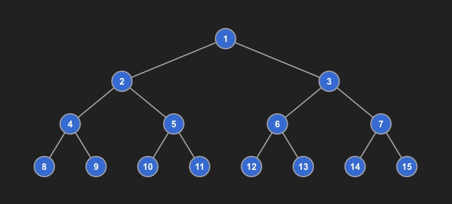
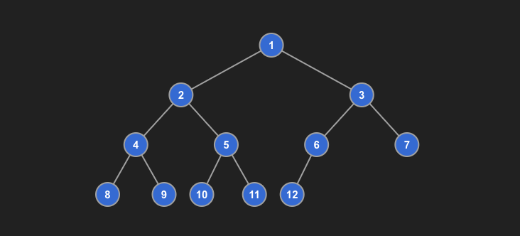
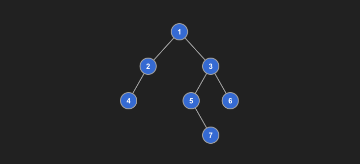
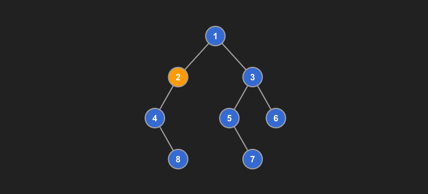

# Binary Tree

## **Introduction**
1. The most important data structure.
2. Many complex data structure are based on binary tree, such as RB-tree, Binary heaps, Graph, etc.
3. It is not just a data structure, it represnets a recursive way of thinking. All recursive algorithms, such as Backtracking algorithm, BFS algorithm, Dynamic Programming (abstracted the problem into binary tree problem).

## Common Types of Binary Tree
1. Full/Perfect Binary Tree
    - 
    - Assuming the depth is `h`, the total number of nodes is `2^h - 1`

2. Complete Binary Tree
    - 
    - Every level is filled from left to right, and except the last level.

3. Binary Search Tree
    1. For every node in the tree, all nodes in its left subtree are less than the node, and all nodes in its right subtree are greater than the node.

4. Height-Balanced Binary Tree
    1. Height difference between the left and right subtrees of every node is **no more than 1**.
    2. Example of height balanced binary tree
        
    3. Example of NOT height balanced binary tree
        
        - As node 2 has a left subtree with height of 2 and right subtree with height of 0.

    4. If a height-balanced tree has *N* nodes, the height of the tree will be `O(log N)`.

5. Self-Balancing Binary Tree
    1. Keep the height balanced while inserting and deleting is important as we want to keep the height to be `O(log N)`.
    2. The key is to "rotate" the tree when the height is unbalanced.