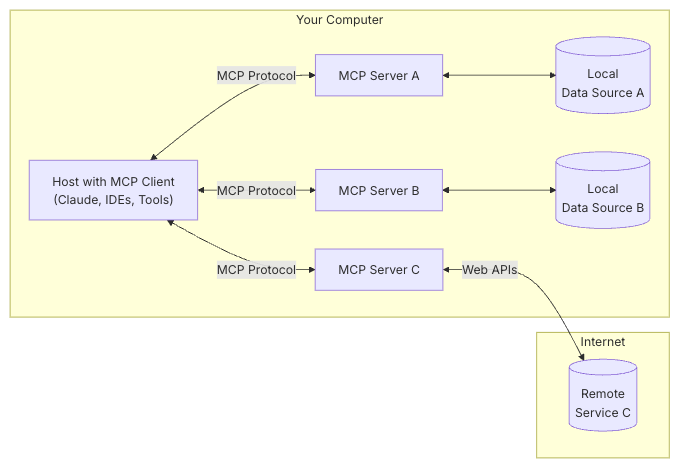

# MCP

## Introduction
- MCP(Model Context Protocol) is a protocol that standardizes how applications provide context to LLMs.
- Just like micro-services

## Why MCP?
- MCP helps you build agent and complex workflows on top of LLMs
- Allow you to connect MCP host to external systems and data sources

## User
- User need to provide hint for LLM to trigger the MCP function
- 由llm去理解用戶的意圖，佢會自動安排workflow

## General Architecture

- MCP Host: Program like Claude Desktop, IDEs, or AI tools that want to access data through MCP
- MCP Client: Protocol clients that maintain 1:1 connection with server
- MCP Server: Lightweight programs that each expose specific capabilities through the standardized MCP, running locally
- Local Data Source: Your computer's files, databases, and serices that MCP servers can access
- Remote Service: External system available over the internet (e.g. through APIs) that MCP servers can connect to

## Flow
a -> MCP Server -> b(query + prompt) -> LLM -> answer

## Transport
- stdio Transport
1
- SSE Transport

## Use Cases
1. Chat Summarization
    - Store chat history in local data source
    - Use SELECT to export chat history to MCP server

    - Security Concern:
        - Data privacy
        - Context Length Limitation

2. For DevOps to update the node version of all nodes in the cluster
    - Use SSE

MCP Server -> Workflow -> LLM
e.g. Check flight ticket on Trip.com -> Buy ticket -> Send trip details to email -> Share to Whatsapp group

## Termnology
1. JSON-RPC
- Use in microservice
- 如何实现一个rpc框架
    - https://juejin.cn/post/7159432042747265054
2. RPA
    - Robotic Process Automation

## Resource
Github MCP Server
- https://github.com/modelcontextprotocol/servers
MCP Client
- https://github.com/punkpeye/awesome-mcp-clients
Opensource from idoubi
- https://github.com/chatmcp
MCP.so
- https://mcp.so/

## mcp-server-flomo
1. start mcp-server SDK
2. call flomo API
3. workflow -> client(cursor) -> rpc -> mcp-server-flomo

## Debugging
1. Use Inspector
https://modelcontextprotocol.io/docs/tools/inspector
```
cd mcp-server-flomo
npm run build
npm run watch
npm run inspector
```

2. mcp-cli 
3. MCP Client

## Setup MCP in Cursor
```
{
  "mcpServers": {
    "mcp-server-flomo": {
      "command": "node",
      "args": [
        "/Users/hoimingkenny/Project/mcp-server-flomo/build/index.js"
      ]
    }
  }
}
```

## Flomo
### Create Memo
```
curl -X POST https://flomoapp.com/iwh/MjI4MjczNA/0808e155c2ddd0763643ed3712e448b9/ -H 'Content-Type: application/json' -d '{"content": "Hello, flomo Im using API"}'
```

```
{
  "code":0,
  "message":"\u5df2\u8bb0\u5f55",
  "memo":{
    "creator_id":2282734,
    "source":"incoming_webhook",
    "content":"<p>Hello, flomo Im using API<\/p>",
    "tags":[],
    "updated_at":"2025-04-28 19:57:18",
    "created_at":"2025-04-28 19:57:18",
    "linked_memos":[],
    "linked_count":0,
    "slug":"MTczNjEyNTY0"
  }
}
```

### Fetch Memo
- Not officially supported in Flomo
- use go-rod

## Cursor Shortcut
- CMD + K: Generate new code or edit existing code in the editor window
- CMD + L: Open the chat
