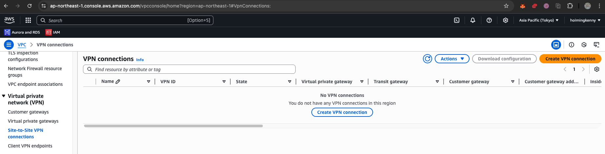

# AWS Guideline

### Validate health status of VPN Tunnel

1. Sign in to the Amazon VPC console.
2. In the navigation pane, under Site-to-Site VPN Connections, choose Site-to-Site VPN Connections.
3. Select your VPN connection.
4. Choose the Tunnel Details view.
5. Review the Status of your VPN tunnel.
6. If the tunnel status is UP, then choose the Static Routes view.

### AWS Backup

## KMS
- Key Management Service
- AWS Managed Key
    - AWS managed key is created, managed and used on your behalf by an AWS service. You have permission to view the AWS managed keys in your account and audit their use in AWS CloudTrail logs. However, you cannot change any properties of AWS managed keys, rotate them, change their key policies, or schedule them for deletion.