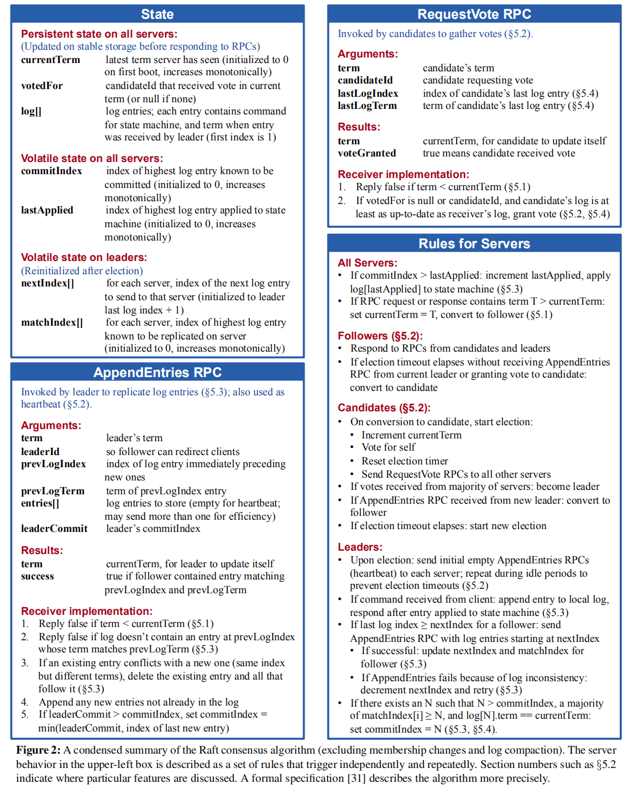
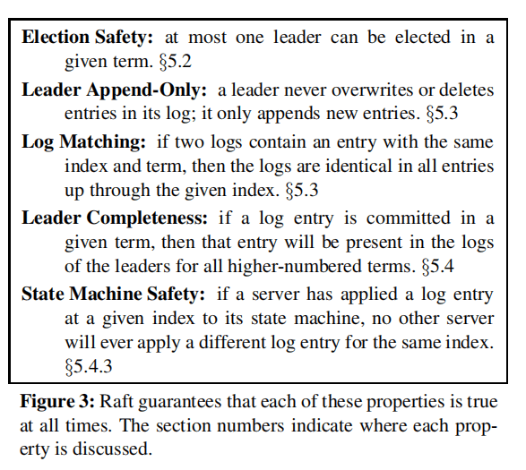
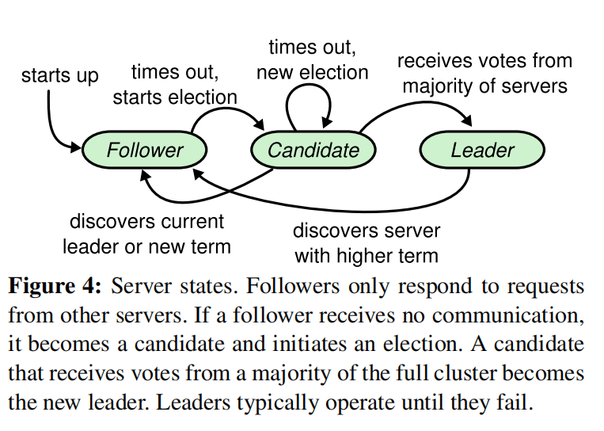
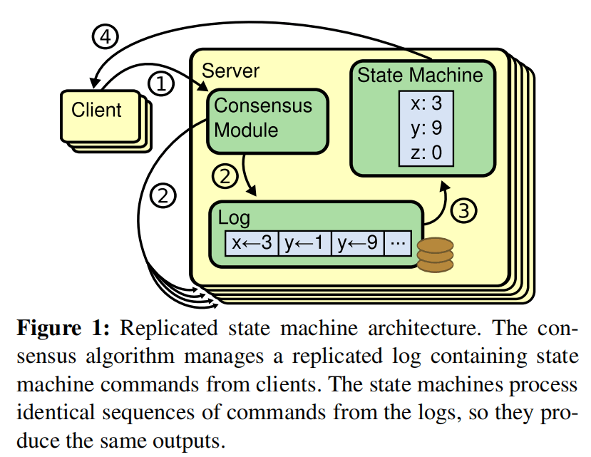
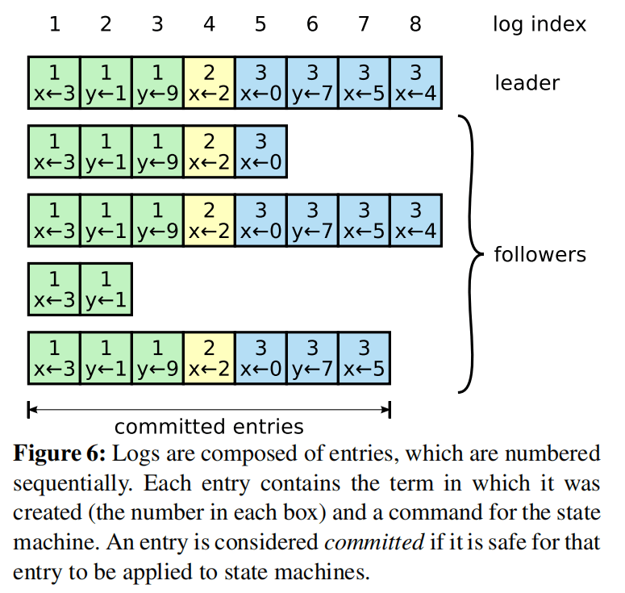
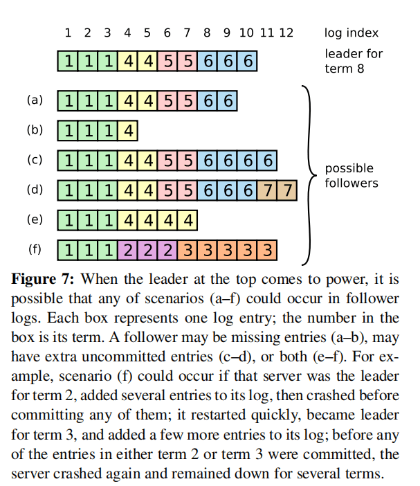
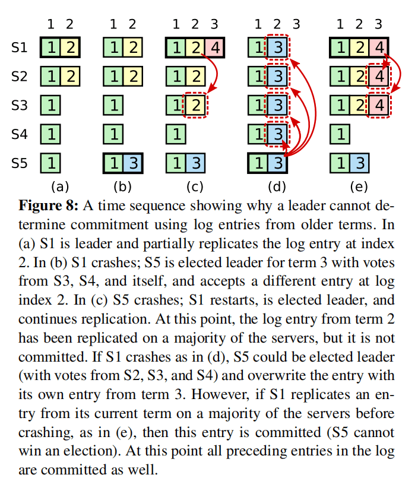

# Raft

## 1. Background
### What is Raft? 
- Raft is a consensus algorithm for managing a replicated log

### Why do we need Raft?
- Think about a question before answering this: **Why do we need consensus algorithm?**
- Raft addresses the issue of data consistency in replicated system.  To avoid single points of failure, software engineers introduce data replication to create multiple copies of data. However, replicating data across multiple copies leads to consistency problems. 
- The need for Raft arises from the complexities of its predecessor, Paxos. Paxos, considered the foundational consensus algorithm, is known for its difficulty in understanding and implementing in practical systems. Raft was developed as a more comprehensible and readily implementable alternative to Paxos. It aims to achieve understandability and ease of implementation by:
  - Decomposing complex problems into smaller, manageable sub-problems.
  - Simplifying state management by imposing constraints to reduce the number of states to consider.

## 2. The Raft Algorithm
Design for Understandability through:
- Problem decomposition: Dividing complex issues into smaller, independently understandable, and solvable sub-problems, such as leader election, log replication, safety, and membership changes
- State simplification: Reducing the number of states to consider by applying constraints, leading to a clearer algorithm with less uncertainty (e.g., ensuring newly elected leaders possess all committed log entries)

Introduction to Raft
Raft elects a leader responsible for managing the replicated log. The leader handles client update requests, replicates them to follower nodes, and executes them when safe. If the leader fails, followers elect a new leader.
Through the leader, Raft decomposes the consistency problem into three independent sub-problems:
- **Leader Election**: Electing a new leader when the cluster starts or the current leader fails.
- **Log Replication**: The leader receives client-submitted logs, replicates them to other nodes in the cluster, and ensures their logs match the leader's.
- **Safety**: Ensuring that if a server applies a log entry to its state machine, other servers cannot apply different entries at the same index, as illustrated in Figure 3.2.

## 3. Sub-Problem
### 1. Leader Election
In Raft, a node can be in one of three states:
- Leader: Handles all client requests, redirecting requests from followers.
- Follower: Passively responds to requests from leaders and candidates.
- Candidate: Used to elect a leader.

Under normal circumstances, there is only one leader, with other nodes as followers.
Raft uses a heartbeat mechanism to trigger leader elections. The state transition process is shown in a diagram.

Keypoint:
- All nodes start as followers
- If a follower doesn't receive a heartbeat(AppendEntries RPCs that carry no log entries) from the leader within a timeout period(a.k.a election timeout), it transitions to the candidate state, increments its term, and initiates an election
- If a candidate receives votes from a majority of nodes (including itself), it becomes the leader
- Each server will vote for at most one candidate in a given term, on a first-come-first-served basis
- Restriction: voter denies its vote if its own log is more up-to-date than that of the candidate
  - Up-to-date: 
    - If the logs have last entries with different terms, then the log with the later term is more up-to-date
    - If the logs end with the same term, then whichever log is longer is more up-to-date
- If a node discovers another node with a higher term, it transitions to the follower state
- Once a candidate wins an election, it becomes leader. It then sends heartbeat messages to all of the other servers to establish its authority and prevent new election
- While waiting for votes, a candidate may receive an AppendEntries RPC from another server claiming to be leader
  - If the term in the RPC < candidate's current term -> the candidate rejects the RPC and continues in candidate state
- If many followers become candidates at the same time -> Split Votes
  - When this happens, each candidate will time out and start a new election by incrementing its term and initiating another round of RequestVote RPC

#### Term
- Time is divided into arbitrary-length terms numbered with consecutive integers
- Each term begins with an election where one or more candidates seek leadership. If a candidate wins, it leads for the rest of the term.
- Split votes may lead to no leader, ending the term and prompting a new one. Raft ensures at most one leader per term.
- **The term acts as a logical clock**, helping servers detect outdated information, such as an expired leader. 
- Each server stores a current term value that increases automatically. 
- Servers exchange current term values during communication and update theirs if it's smaller than the other. 
- Candidates or leaders with an outdated term immediately revert to follower status. 
- Nodes reject requests with outdated terms.

#### Split Vote
- If all followers simultaneously initiate elections upon timeout (due to voting for themselves), it could lead to a deadlock where no node secures a majority, resulting in repeated election failures.
- To prevent this, Raft uses randomized election timeouts within a fixed interval (e.g., 150-300ms). This ensures that, in most cases, only one server detects a timeout and initiates an election before others, increasing its chances of winning.

### 2. Log Replication
Once a leader is established, the system can provide services. Each client write request includes a command for the state machine to execute. The leader appends this command as a new log entry and concurrently sends AppendEntries RPCs to other servers to replicate it.

After replication, the leader applies the log to its state machine, returning the result to the client. Even with follower failures, slow performance, or packet loss, the leader retries the RPC until all followers store the same log.

#### Replicated State Machine
Consensus algorithms are typically implemented based on replicated state machines to address fault tolerance in distributed systems.

Two identical, deterministic processes starting in the same state and receiving the same inputs in the same order will produce the same output and end in the same state. 
In simpler terms: **Same Initial State + Same Input = Same End State**

Replicated logs are commonly used to implement replicated state machines, as shown in a diagram (not provided).

Each server has a log containing a series of commands, which the state machine executes sequentially. All logs store the same commands in the same order, ensuring each state machine processes identical instructions, resulting in consistent states and outputs.

The task of the consensus algorithm is **to ensure the consistency of the replicated log**. The server's consistency module receives client commands, adds them to its log, and communicates with other consistency modules to ensure all logs have the same content and order, even with server failures. A correctly replicated command is considered **committed**. Each server's state machine processes committed commands in log order and returns the output to the client.

#### Request Handling Process
From the leader's perspective, handling a client write request involves the following steps:
1. The leader appends the log entry
2. The leader issues AppendEntries RPCs in parallel
3. The leader waits for a majority response
4. The leader applies the entry to the state machine
5. The leader replies to the client
6. The leader notifies followers to apply the log

The log submission process resembles a two-phase commit (2PC), but unlike 2PC, the leader only requires a majority response, ensuring system availability as long as over half the nodes are operational.
The leader only needs to replicate the log to most nodes before responding to the client. Once a success message is sent, the system must guarantee that the log (and its command) won't be rolled back under any circumstances. Two key terms here are:
- **Commit (committed)**: The state of a log after being replicated to a majority of nodes.
- **Apply (applied)**: The state after a node applies the log to its state machine, affecting the node's state.

Logs are organized as shown in a diagram:

Each entry stores a command and the leader's term number when it received the command. The term number helps detect inconsistencies, and an integer index allows for positioning.
The diagram illustrates that the logs across five nodes are not perfectly consistent. To ensure high availability, **Raft uses eventual consistency instead of strong consistency**. The leader continuously sends log entries to followers until all nodes have identical entries.

### 3. Safety
Distributed algorithms are evaluated based on various attributes, such as:
- Safety: Nothing bad happens
- Liveness: Something good eventually happens

Safety is crucial in any system model, preventing irreversible errors and incorrect information returned to clients. Raft guarantees that logs replicated to a majority of nodes won't be rolled back, demonstrating the safety property. The eventual consistency achieved by Raft, where all nodes eventually reach the same state, represents the liveness property.

Raft ensures the following properties:

#### Election Safety
Guaranteeing at most one leader per term is vital to prevent brain split, a serious issue that can lead to data loss due to multiple leaders in a replication set. Raft ensures this property through:
- Each Node can only vote once per term.
- Only nodes with a majority vote becoming leaders.
Therefore, there can only be one leader in any given term.

#### Leader Append-Only
Leaders can only append log entries, not overwrite or delete them. This restriction is straightforward to implement.

#### Log Matching
This property states that if two nodes have a log entry with the same log index and term, all preceding log entries must be identical. 

This relies on:
- Leaders creating only one log entry per term at a specific position, with log entries being append-only.
- Consistency checks: In AppendEntries, the leader includes the term and index of the log entry preceding the latest one. If a follower can't find the log at the corresponding term and index, it informs the leader of the inconsistency.

Log matching is easy to maintain under normal conditions. However, node crashes complicate matters, as shown in a diagram:

The diagram depicts six possible states (a-f) that a follower might have. 

Both leaders and followers can crash, leading to these scenarios for a follower's log compared to the leader's:
- Fewer log entries than the leader (states a and b)
- More log entries than the leader (states c and d)
- Some positions with more entries, others with fewer compared to the leader (states e and f)

**When inconsistencies arise between the leader and follower, the leader forces the follower's log to match its own.**

To achieve this, the leader identifies the last consistent log index between itself and the follower, deletes subsequent entries from the follower's log, and sends all its entries after that point to the follower. These actions occur during the consistency check of the AppendEntries RPC.
The leader maintains a nextIndex value for each follower, indicating the next log index to send. Upon taking leadership, the leader initializes all nextIndex values to the index following the last log entry (11 in the diagram). If the follower's log doesn't match, the next AppendEntries consistency check fails. The leader decrements the follower's nextIndex and retries upon rejection. Eventually, nextIndex reaches the last consistent point, allowing the AppendEntries RPC to succeed, overwrite the follower's subsequent entries, and ensure consistency with the leader's log until the term ends.

#### Leader Completeness
In any leader-based consensus algorithm, the leader must eventually possess all committed logs.

Some algorithms (e.g., Viewstamped Replication) allow nodes to become leaders without all committed logs, relying on separate mechanisms to locate and transfer missing entries to the new leader. This adds complexity. Raft uses a simpler approach, ensuring all committed logs are present in every newly elected leader without log transfer. Consequently, logs only flow from the leader to followers, eliminating the need to rewrite logs.

Raft uses the voting process to guarantee that elected leaders contain all committed logs:
1. Nodes only vote for candidates with committed logs equal to or exceeding their own
2. Candidates need a majority vote to win
3. Leaders replicate logs to a majority of nodes

This ensures that every elected leader holds the latest committed log.

#### State Machine Safety
Once a log is successfully replicated to most nodes, the leader knows it can be committed. If the leader crashes before committing, the new leader attempts to complete the replication. However, a leader can't immediately deduce that entries from the previous term are committed.

Below diagram illustrates a complex scenario:

- At time (a), s1 is the leader in term 2, committing a log entry only replicated to itself and s2 before crashing.
- At time (b), s5 becomes the leader in term 3, replicates the log only to itself, and crashes.
- At time (c), s1 becomes the leader again in term 4, replicates the term 2 log entry to s3, reaching a majority, making it committed and applicable to the state machine.
- Unfortunately, at time (d), s1 crashes, s5 is re-elected, and replicates its term 3 log to all nodes, leading to a rollback of the committed term 2 log entry.

This issue arises because the term 4 leader (s1) committed a previous term's log entry at time (c). To prevent this, Raft imposes the following restriction:
- Elected leaders don't immediately commit logs from the previous leader's term. Instead, they "incidentally" commit earlier entries by committing the current term's logs. The log matching section provides details on this implementation.
- To avoid scenarios where a leader receives no client requests throughout its term, leading to uncommitted logs, the leader immediately replicates and attempts to commit an empty log entry at the beginning of its term.
- Therefore, in the scenario described, time (c) wouldn't occur. The term 4 leader (s1) wouldn't replicate the term 2 log to s3. Instead, as depicted at time (e), it commits the term 2 log by replicating and committing the term 4 log. Upon successful term 4 log committal, the term 2 log is guaranteed to be committed as well, preventing s5's re-election even if s1 crashes.

### 4. Summary
Raft breaks down the consensus problem into three independent sub-problems: leader election, log replication, and safety.

The process involves electing a leader, which then replicates and commits logs (containing commands). Safety restrictions ensure Raft avoids or handles various exceptions.

Leader election constraints:
- One vote per term per node.
- Nodes only vote for candidates with logs equal to or newer than their own.
   
Log replication constraints:
- Logs replicated to a majority of nodes are considered committed, guaranteeing no rollback.
- Leaders always contain the latest committed log, leading to log appending without deletion or overwriting.
- Matching log entries at a specific position across different nodes guarantee identical preceding log entries.
- Raft never commits previous term log entries solely by counting replicas.

## 4. Summary Question
### I. Leader Election
#### 1. Provide a concise overview of the mechanism for leader election.
#### 2. What roles exist in the Raft protocol, and what are their respective responsibilities?
#### 3. What is leader election in the Raft protocol, and what happens if leader election fails?
#### 4. How do Follower, Candidate, and Leader states transition in the Raft protocol?
#### 5. What is a Term in the Raft protocol, and how is it used to ensure consistency?
#### 6. How does the Raft protocol prevent performance degradation caused by excessive leader elections?
#### 7. What is the heartbeat mechanism in the Raft protocol, and what is its purpose?
#### 8. What is a Quorum in the Raft protocol, and what role does it play?

### II. Log Replication
#### 1. Provide a concise overview of the mechanism for log replication.
#### 2. What is log compaction in the Raft protocol, and what is its purpose?
#### 3. How does the Raft protocol handle log replication issues and resolve log conflicts?
#### 4. How does the Raft protocol handle the dynamic addition and removal of nodes?
#### 5. How does the Raft protocol process client requests?

### III. Use Cases
#### 1. What are the limitations of the Raft protocol, and in what scenarios is it not suitable for use?

### IV. Related Protocols
#### 1. What are the strengths and weaknesses of the Raft protocol? How does it compare to other distributed consensus protocols?
#### 2. What are the variants of the Raft protocol?

### V. Security and Fault Recovery
#### 1. How does the Raft protocol prevent split-brain scenarios?
#### 2. How does the Raft protocol handle node failures while ensuring data consistency remains unaffected?
#### 3. What are the key safety properties of the Raft protocol, and how are they guaranteed?

## Reference
1. Thesis Explanation: https://blog.csdn.net/qq_40586495/article/details/123035781
2. Thesis Explanation2: https://www.cnblogs.com/linbingdong/p/6442673.html
3. Raft 算法概論: https://www.lixueduan.com/posts/distributed/raft/