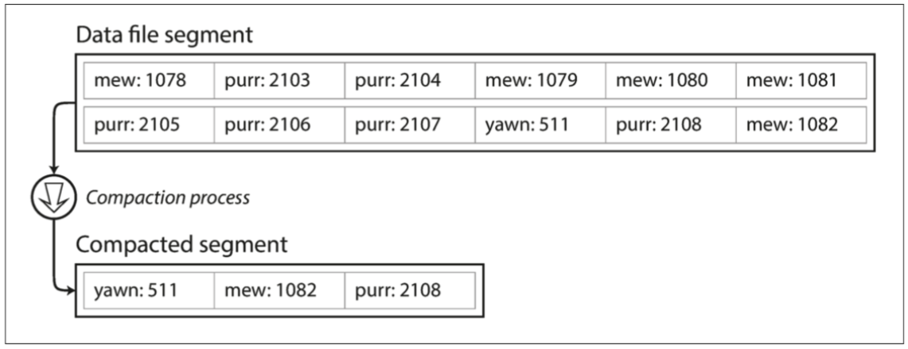
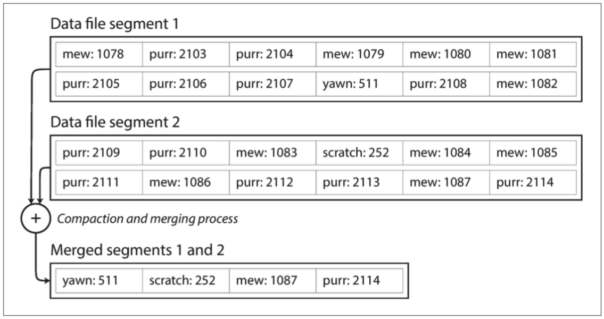
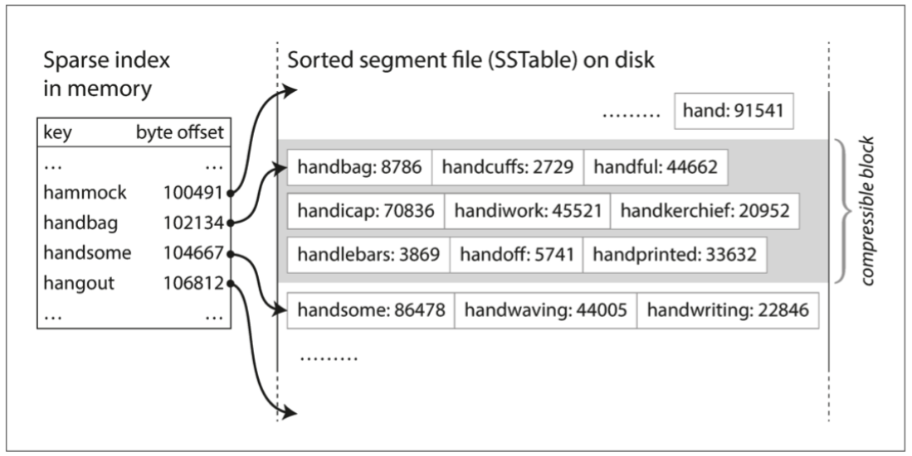

# I. Storage and Retrieval
### Bitcask
- 與Dictionary很相似，通常都是用hash table實現的
- 假設我們的數據存儲只是一個加寫入的文件，使用in-memory hash map，每個key都map到一個數據文件的byte offset，指明可以找到對應值的位置。

&nbsp;

- 提供了高性能的讀取和寫入，但所有key必須放入可用的memory中
- 為了最終避免用完disk space，將日志分為特定大小的段，當日志增長到特定size時關閉當前段文件，并開始寫入一個新的segment文件，然後對這些segment進行compaction，即丟棄重復的key，只保留每個key的最近更新。

- 由於compaction會使得segment變得很小（如果一個key被重寫了很多次），我們可以將多個segment合并在一起。segment被寫入後永遠不會被修改，會被寫入一個新的文件。
- 凍結段的compaction和merging可以在後台thread中完成，在進行時，我們仍然可以繼續使用舊的段文件來正常提供讀寫請求。合并完成後，我們將讀取請求轉換為使用新的合并段而不是舊段，然後可以簡單地刪除舊的段文件。

- 每個段都有自己的in-memory hash table，將keys map到文件的offset。在找key的值，我們會先找最新的段的hash map，如果不存在，我們會找第二個最新的段，如此類推。

- 有以下細節需要留意：
  - File Format: CSV不是日志的最佳格式，使用binary format更快。首先以byte為單位對string的長度進行encoding，然後使用raw string(不需要escaping轉義)
  - Deleting Records: 如果要刪除一個key及其value，則必須在數據文件(有時稱為tombstone)中附加一個特殊的刪除紀錄。當日志段被合并時，tombstone會告訴合并過程去discard刪除鍵的任何以前的value。
  - Crash Recovery: 如果db重啟，in-memory hash map將丟失。理論上，可以通過從頭到尾讀取整個段文件，并根據每個鍵的最近值的offset來恢復每個段的hash map，但這將要很長時間，如果文件是超大。Bitcask通過恢復disk上每個segment的hash map的snapshot，可以更快地加載到內存中。
  - Partially Written Records: db可能隨時崩潰，可以halfway through appending record to log。Bitcask文件包含checksum來檢測和忽略這些損壞部份。
  - Concurrency Control: write操作是以嚴格的順序加到日志中，最常見的實現是只有一個writer thread，segments是append-only和immutable，所以它們可以被多個threads同時讀取。
    - 但為什麼update file而要用append-only的方式？ 
      - appending和segment merging是順序的寫入操作，比random writes快很多，特別在magnetic spinning disk hard drive。
			- 會令concurrency和crash recovery變得簡單，例如不必擔心value被overwritten時發生crash，留下一個同時有新和舊值的文件。
      - merging可以避免數據文件隨時間推移而變得快散。
  - hash table的局限性: hash table只能放進memory，如果有太多keys會產生問題。理論上可以把hash map放到disk，但不幸地會影響性能。它需要大量的random access I/O，當它變滿時是很昂貴的，而且要解決hash collision。
  - range queries的效率不高，例如無法輕鬆scan "kitty00000"和"kitty99999"之間的所有key，必須在hash map中單獨查找所有key。

### SSTable
- Sorting String Table
- 在bitcask中，每個日志段都是一系列的key-value pair，而且按照它們的寫入次序出現，而且最新的鍵值會優先於較舊的鍵值，不重視key的排序。
- 而SSTable把key-value pair按key來排序，而且要求每個key只在每個合并的segment中出現一次(壓縮過程已經保證)
- Merging: 跟mergesort很相似，并排讀取輸入文件，查看每個文件的第一個key，複制最低key(根據sort order)到輸出文件，并重復以上動作，這會產生新的merged文件。
- 如果在幾個Segment都出現相同的key，我們只保留最新的segment中的key's value。因為每一個segment都包含了一段時間寫入db的所有值。
- Searching for key: 不需要再在memory中掃描所有的key的index。例如現在找的是"handiwork"，但不知道它的byte offset。然而你知道"handbag" 和"handsome"的offset，由於是排序的，因此"handiwork"必須出現在兩者之間。
- 我們只需要in-memory index去讓我們知道某一些key的offset，例如每幾千字節的段文件就有一個key就會很足夠。
  
- 可使用紅黑樹或AVL樹，可以按任何順序插入鍵，并按排序順序讀取它們。
- 寫入時，將其添加到memory中的balanced tree(例如紅黑樹)，這個內存樹有時被稱為memtable。
- 當memtable大于某個threshold時，通常為幾megabytes，將其作為SSTable寫入disk中。由于樹已經維護了按key排序的key-value pairs。新的SSTable會成為db中最新的segment。而當SSTable被寫入disk時，可以在一個新的memtable instance繼續寫入。
- 會定時在後台合并和壓縮segment files及丟棄overwritten或deleted value
- 如果遇到db crash時，最新的write可以會lost(in the memtable但未寫到disk上)。因此，我們需要保存一個單獨的日志，每個寫入都會立即被附加到disk上，因此該日志不是按順序排序的，但這不重要。因為它的目的是在crash後restore memtable。

### LSM Tree
- Log-Structured Merge-Tree
- 其實就是由memtable+SSTable構成。當有新的write，先寫入到memtable，當它大于某個threshold時就寫入到disk。其後，會壓縮及合并多個SSTable來刪除重復及舊的值，來減少storage空間。
- 可使用Bloom Filter來快速查找一個key是否出現在SSTable，不用look up所有segment來確定key的存在
- Write-ahead log: Write先會被寫到write-ahead log再寫到memtable

### B-Tree
- 

