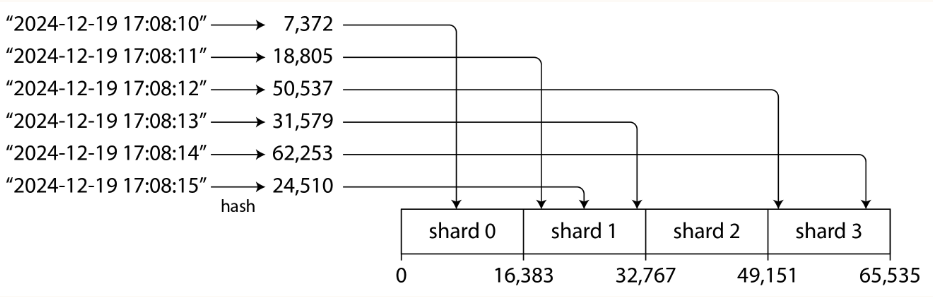

import Highlight from '@site/src/components/Highlight'
import Warn from '@site/src/components/Warn'
import Term from '@site/src/components/Term'
import Term2 from '@site/src/components/Term2'

# Sharding

## Introduction
A distributed database distributes data across multiple nodes.
1. Replication: having a copy of the same data on multiple nodes.
2. Sharding: Split up a large database into smaller pieces (shards or partitions). And store different shards on different nodes.

- Sharding is usually combined with replication so that copies of each shard are stored on multiple nodes.

- A node may store more than one shard. Each shard's leader is assigned to one node, and its followers are assigned to other nodes.

- Shard has many different names. In Kafka, it called partition, called range in CockroachDB.
- In PostgreSQL, it treats partition and shards as two distnct concepts. Partitioning is a way to splitting large table into several files that are stored on the same machine, whereas sharding split a dataset across multiple machines.

####  Pros and Cons
- Pros: The primary reason for sharding is scalability, spread the write load across multiple nodes (horizontal scaling).
- Cons: Add complexity as we need to decide which records go to which shard by choosing partiion key.

## Sharding of Key-Value Data
1. Our goal is to spread the data and the query load evenly across multiple nodes.
2. If some shards are more busy than others, we call it *skewed*.
3. A shard with disproportionately high load is called a *hot shard* or *hot spot*.
4. If one key with a particularly high lead (e.g. celebrity in social network), we call it a *hot key*.

### Sharding by Key Range

1. To assign a contiguous range of partition keys to each shard.
2. The range of keys are not necessarily evenly distributed, because your data may not be evenly distributed.
3. The database can choose the shard boundaries.
4. Within each shard, keys are stored in sorted order (e.g., in B-tree or SSTables), make range scan easy.

- Advantage: The number of shards apapts to the data volume.
- Disadvantage: Splitting a shard is expensive since it requires all data to be rewritten into new shards.

#### Rebalancing key-range sharded data
1. Some database, such HBase and MongoDB, allow you to configure an initial set of shards on an empty database, which is called *pre-splitting*.
2. As the data volume and write throughput grows, an existing shard can be shard into two or more smaller shards, each of which holds a contiguous sub-range of the original shard's key range.
3. The resulting smaller shards can then be distributed across the multiple nodes.
4. Shard split is typically triggered by:
    - The shard reaching a configured size (for example, on HBase, 10GB)
    - The write throughput of the shard reaches a configured threshold. A hot shard may be split even if it is not storing a lot of data.

### Sharding by Hash of Key
1. Hash the partition key before mapping to shard 
2. Good hash function required: The hashes can be evenly distributed across the space.

#### Hash modulo number of nodes

1. Mod N approach, `hash(key) % number of nodes`
2. Issue: Change in number of nodes, keys need to be rebalanced from one node to another.

#### Fixed number of shards

1. Configure the the number of shard in the very begining.
2. To create many more shards than there are nodes, and to assign several shards to each node.
3. For example, 1000 shards are created for 10 nodes, so that on average 100 shards are assigned to each node.
4. Add a new node, the system can reassign some of the shards from existing node to new node until they are fairly distributed once again.
5. Remove a new node, the same happens in reverse.
6. Pros: 
    1. Only entire shards are moved between nodes, which is cheaper than splitting nodes.
    2. The number of shards does not change, nor does the assignment of keys to shard. The only change is the assignment of shards to nodes.
7. Cons:
    1. Resharding operation is expensive. If you want to reconfigure the number of shards. Need to split each shard and write it out to new files + additional disk space.
    2. Need downtime to resharding in some system.

#### Sharding by hash range

1. To combine key-range sharding with hash function so that each shard contains a range of hash values rather than a range of keys
2. Has risk of hot spots when there are lot of writes to nearby keys.
3. Pros: 
    - A Shard in hash range can be split when it becomes too big or too heavily loaded.
    - Can scale well when the number of data is increasing, but the operation is expensive.
4. Cons:
    - range queries over the partition key are not efficient as keys are now scattered across all the shards.
    - However, if keys consist of two or more columns, and the partition key is only the first colume, we can still perform efficient range queries over the second and later columns. They have the same partition key so they are in the same shard.
5. Used in DynamoDB, and is an option in MongoDB.
6. Cassandra and ScyllaDB use a variant of this approach:
    - 3 ranges per node here, but in Cassandra by default, the actual number is 8 per nodes.
    - Split the range of possible hash values into contiguous ranges with random boundaries, and assign several ranges to each node.
    - Add/Remove new node
        
        
		- when n3 is added, n1 transfer parts of two of its ranges to n3.
		- n2 transfer parts of one of its ranges to n3.
		- Only transfer necessary amount of data to new node.

#### <Term>Consistent Hashing</Term>
- Consistent Hashing algorithm is a hash function that maps keys to a specificied number of shards that satisfies two properties:
    1. The number of keys mapped to each shard is roughly equal.
    2. When the number of shards changes, as few keys as possible are moved from one shard to another.

- Simple approach: Simple Modulo Hashing
    - `database_id = hash(order_id) % num_databases`
    - Problem: Add/Remove database instance costs the data in all databases to be re-distributed as the number of databases changes.

- Consistent Hashing
    - Solve the problem of data redistribution when adding or removing a instance in a distributed system.

    - Start with 4 nodes
        
    - Adding a Database
        
    - Removing a Database
        

### Skewed Workloads and Relieving Hot Spots
- Consistent hashing ensure that keys are uniformly distributed across nodes, but DOES NOT mean that the actual load is uniformly distributed.
- If workload is highly skewed, that is, the amount of data under some partition keys in much greater than other keys.
- The rate of requests to some keys is much higher than to others.

- Example, celebrity with millions of followers may cause a storm of activity when they do something. If the partition key is the userId of celebrity, these events can result in a large volume of r&w.

	
- Flexible sharding policy is required. The system can put an individual hot key in a shard by its own, and even assigning it a dedicated machine.
- At application level
	- For write, add a random number to the beginning or the end of the key.
		- Just a two digit decimal random number would split the writes to the key evenly across 100 different keys, allowing those keys to be distributed to different shards.
	- For read, need to read the data from all 100 keys and combine it.
		- The volume of reads to each shard of the hot key is not reduced.
		- Require additional bookkeeping, to keep track of which keys are being split.
		- Only make sense to append the random number for the small number of hot keys, for majority of keys with low write throughput would be unnecessary overhead.

- Need different strategies to handle below situation:
	- For seasonal load over time, for example, some post that has gone viral may experience high load for a couple of days, but thereafter it's likely to calm down again.
	- Some keys may be hot for writes while others are hot for reads.

### Operations: Automatic or Manual Rebalancing
1. Fully automated: Cloud database, such as DynamoDB, are able to automatically add and remove shards to adapt to big increases or decreases of load within a matter of minutes.
2. Half-automated: Some systems generate a suggested shard assignment automatically, but require an administrator to commit it before it takes effect.
3. Cons of auto-sharding: unpredictable
	1. Rebalancing is expensive.
	2. Require rerouting requests and moving large amount of data from one node to another.
	3. The system must continue processing writes while the rebalancing is in progress.
	4. If a system is near its maximum write throughput, the shard-splitting process might not even be able to keep up with the rate of incoming writes.
    5. Can be dangerous when the automation combines with automatic failure detection.
	6. Say, one node is overloaded and is temporarily slow to response to requests.
	7. The other nodes conclude that the overloaded node is dead, and automatically rebalance the cluster to move load away from it.
    8. This puts additional load on other nodes and the network.
4. Solution: to have a human in the loop for rebalancing.

## Request Routing
- For finding the target shard (reside in a node) for read or write with particular key. Like, which IP address and port number.
- Request Routing of database node vs Service Discovery
	○ Service discovery: for multiple instances of service, each instance is usually stateless, and a load balancer can send a request to any of the instances.
	○ With sharded databases, a request for a key can only be handled by a node that is a replica for the shard containing that key.
- Solution to routing request to shards based on key.
    
    1. Forward the requests to any node (e.g. via a round-robin load balancer)
		- If that node owns the shards to which the request applies, it can handle it directly; otherwise, it forwards the request to the appropriate node, receives the reply, and passes the reply along to client.
	2. Send all requests from clients to routing tier first, which determines the node that should handle each request and forwards it accordingly.
		- The routing tier only acts as shard-ware load balancer.
	3. The clients connect directly to the appropriate node.
		- Require it to has the knowledge of which shard is assigned to which node.

- Some issues:
	1. Who decides which shard should live on which node? 
	    - -> Yes, we can use a single coordinator to make that decision. 
		- Next, But what if it goes down? We can failover the coordinator to another node?
		- Next question, How do you prevent split-brain situation where two different coordinators make contradictory shard assignment?
	2. How does the component performing routing (e.g. nodes, routing tier, or the client) learn about changes in the assignment of shards to nodes.
	3. How to handle request during the cutover period (new system goes live and the old one is retired) when a shard is being moved from one node to another?  but requests to the old node may still in flight. How to handle?

- Many distributed data system rely on a separate coordination service such as zookeeper or etcd to keep track of shard assignments.
    
    - They use consensus algorithms to provide fault tolerance and protection against split-brain.
	- Each node register itself in ZooKeeper, and ZK maintains the authoritative mapping of shards to nodes.
	- Routing tier or the sharding-aware client can subscribe to this info. in ZK.
	- Whenever a shard changes ownership, or a node is added or removed, ZK notifies the routing tier so that it can keep its routing info. up to date.

- For example, Hbase use ZK to manage shard assignment, and Kubernetes use etcd to keep track of which service instance is running where.
	- Kafka use built-in implementations of Raft consensus protocol to perform the coordination function.
	- Cassandra use gossip protocol among nodes to disseminate any changes in cluster state.
		- Provide much weaker consistency than a consensus protocol, possible to have split brain.
		- in which different parts of the cluster have different node assignment for the same shard.

## Sharding and Secondary Indexes
- Problem with secondary index: they don't map neatly to shards.

#### Local Secondary Indexes

- Example of Selling Used Car, ID as the partition key.
- Each shard maintain its own secondary indexes, covering only the records in that shard.
- In an information retrieval context it is known as document-partitioned index.
- If you know the partition key, you can just perform the search on the appropriate shard.
- If you want all result, say color:red, you need to send query to all shards, and combine the results you get back, because the matching records might be scattered across all the shards.
- Querying a sharded DB on secondary index is expensive
    - even if you query shards in parallel.
    - Cannot increase query throughput when adding more shards if every shards has to process every query.
- Widely used for example, MongoDB, Cassandra, Elasticsearch.

#### Global Secondary Indexes

1. Global index also be sharded, it cannot be stored on one node since it would likely become bottleneck.
    - Index is sharded, colors starting from letter a to r appear in shard 0, and colors starting with s to z appear in shard 1.
    - All Ids of red cars from all shards appear under color:red in the index.
2. Global secondary index reflects data from all shards. Also called term-partitioned.
3. Use the term as partition key, so when youre looking for a particular term or value, you can figure out which shard you need to query.
4. A shard can contain a contiguous range of terms.
5. Adv: a query with single condition (such as color = red) only need to read from a single shard to fetch the posting list.
    - However, if you want to fetch records and not just IDs, you still need to read from all the shards corresponding to those IDs.
6. If have multiple search conditions (e.g. color: red, or certain make)
    - Need to find all the IDs that occur in both of the postings lists.
    - If the list are long, it can be slow to send them over the network to computer their intersection
7. Another challenge:
    - Writes are more complicated then with local indexes. Because writing a single recode (have multiple columns that are indexed) might affect multiple shards of the index (every term(index) might be on a different shard).
    - Hard to keep the secondary index in sync with the underlying data?
    - Solution: to use distributed transaction to atomically update the shards storing the primary recornd and its secondary indexes.
8. Used by CockroachDB, TiDB…
9. DynamoDB support both local and global secondary indexes, so read from global index may be stale.
10. Adv: global indexes are useful 1) read throughput > write throughput, 2) if the posting lists are not too long.

## Summary
1. Sharding: To split large dataset into smaller subsets. It is necessary when you have so much data that storing and processing it on a single machine is no longer feasible.
2. Goal of Sharding: To spread the data and query load evenly across multiple machines, avoiding hot spots. And, rebalancing the shards when nodes are added to or removed from the cluster.
3. Two main approach to sharding:
    1. Key Range Sharding:
        - Keys are sorted
        - A shard own a range of key
        - Adv: Efficient range queries
        - Disadv: Risk of hot spots
        - Typically rebalanced by splitting the range into two subranges when a shard get too big.
    2. Hash Sharding:
        - Hash function is applied to each key.
        - Shard owns a range of hash values.
        - This method destroys the ordering of keys, making range queries inefficient, but distribute load more evenly.
        - Common to create a fixed number of shards in advance, to assign several shards to each node, and to move entire shards from one node to another when nodes are added or removed.
4. Common to use the first part of the key as the partition key (i.e., to identify the shard), and to sort records within that shard by the rest of the key. That way you can have efficient range queries among the records with the same partition key.
5. Secondary Index: Local Secondary Index and Global Secondary Index.
6. Local Secondary Index
    - Stored in the same shard as the primary key and value.
    - Write: only a single shard needs to be updated.
    - Read: Require reading from all shards. • 7. Global Secondary Index
    - Indexed are sharded based on the indexed values.
    - An entry in the secondary index may refer to the records from all shards of primary key (partition key)
    - When a record is updated, several secondary index shards may need to be updated.
    - A read of the posting list (entries) can be served from a single shard, but fetching the actual records still requires reading from multiple shards.
7. For request routing, we can use coordination service to keep track of the assignment of shards to nodes.
8. Sharded database is allowed to scale to multiple machines. Write need to apply to several shards.
    - Problem could occur: what happens if the write to one shard succeeds, but another failes.