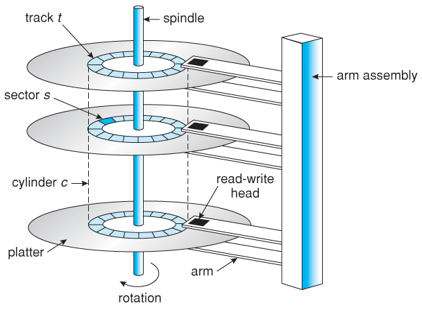
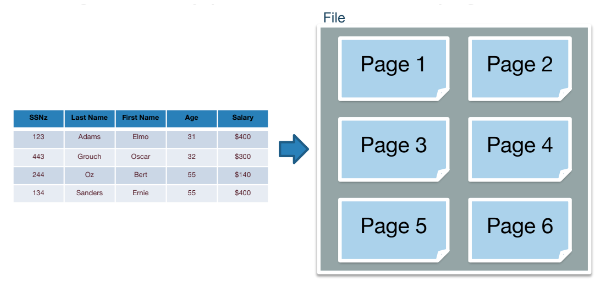

# Storage System Basic

## Hard Disk Physical Structure
- 會有多個platters組成。

1. Platter: for data storage
2. R/W Head: for reading and writing data
3. Spindle Motor: spin the platter
4. Actuator Arm: control the movement of R/W head

## Data Storage Process
- OS use file system -> Buffer Memory -> DB(Hard Disk)

## RAID
- Data storage technology that combine multiple physical disk drives into single logical unit
- Data Redundancy: duplication/將data分配到不同的disk來防止data loss
- Performance Improvement: 將data分拆到不同的disk，concurrently read/write data

## Memory and Disk
- Basic unit of data for relational database: record(row)
    - records are organized into relations(table)
- Basic unit of data for disk: page
    - the smallest unit of transfer from disk to memory and vice versa
- 每一個relation is stored in its own file
- its record are stored into pages in the file

- 1 I/O = 1 page read from disk or 1 page write to disk

## Index
### Why need index?
- 定義在存儲表上，在無需scan所有records的情怳下快速定義所需record的一種輔助存儲結構，由一系列存儲在disk上的index entries組成，由兩部份組成：
    - Index Field: 某些column的值
    - Pointer: record在disk的存儲位置

- Size of index < Size of all record
- 通過檢索小的index文件，可快速定後，再針對性讀取很大的主文件中的record
- 有索引後，更新操作必須同步更新宗引文件和主文件

Index Term:
- Key = Primary Key = Table Key，具有唯一性
- Index Key = Index Field: 不一定具有唯一性
- Order key: 對主文件進行排序存儲那些屬性或屬性集
- Search key: 在主文件中查找紀錄的屬性或屬性集

### How to evaluate an index?
- 增加了存儲空間，維護負搶
- 訪問時間,插入時間,刪取時間
- 空間負載

### Dense Index vs Sparse Index
- DI: index文件包含了主文件對應column中的所有不同值
- SI: index文件包含了主文件對應column中的**部份**不同值

- How SI find record?
    - 找相鄰的小于K的最大index的索引項，從該index所對應的記錄開始順序search
    - Compare to DI，空間佔用更少，維護負擔更輕，但速度更慢

- DI
    - 如果侯選屬性或非侯選屬性的di中不存在Search Key的值，就代表主文件沒有對應SK的文件
    - 三種情怳:
        1. 主文件按索引字段排序且索引字段不是侯選鍵，索引文件的Index Key不重復
        2. 主文件未按索引字段排序且索引字段不是侯選鍵，索引文件的Index Key有重復
        3. 主文件未按索引字段排序且索引字段不是侯選鍵，引入Pointer Bucket處理

- 索引文件的索引字段值是不重複的

### Primary Index vs Secondary Index
#### Primary Index
- Primany Index: Index Key不是指向某一條record，而是指向存儲block
- Block中的第一條record稱為anchor record/block anchor
- Primary Index is Sparse Index
- Index File是按index key進行排序的有序文件，通常建立在主文件按Primary Key排序字段上
- Cluster Index

#### Seconday Index
- 定義在主文件的任一或多個非排序字段上的輔助存儲結構
- 建立在Primay Key以外的屬性上
- 是Dense Index
- Non-cluster index

### Other Types of Index 
- 倒排宗引
    - 正排: 一個文檔包含那些index
    - 倒排: 一個index放在那些文檔中

##### Reference
1. https://cs186berkeley.net/notes/note3/