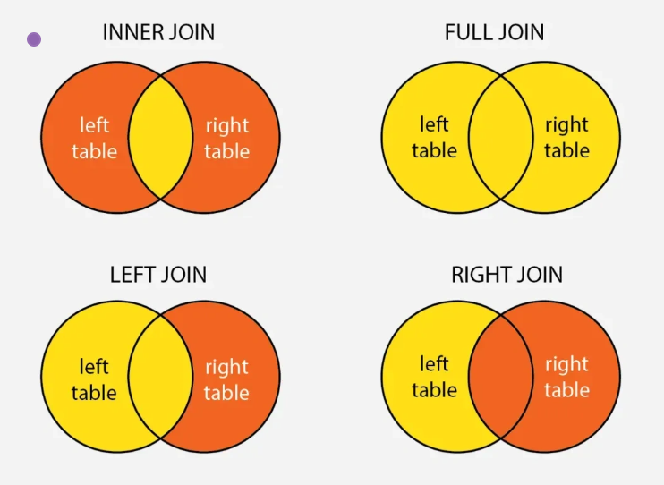

# Basic

### 1. What are the three normal forms of a database?
1. First Normal Form (1NF)
    - Requires that each column in a database table contains indivisible atomic data items.

        | Student ID | Name       | Family Information        | School Information         |
        |------------|------------|---------------------------|----------------------------|
        | 1          | John Doe   | Parents: Mike, Jane       | School: XYZ High, Grade: A |
        | 2          | Jane Smith | Parents: Bob, Alice       | School: ABC High, Grade: B |
    - Here, the "Family Information" and "School Information" columns contain multiple pieces of data.

    - Adjusted Table (Satisfies 1NF):

        | Student ID | Name       | Parent 1 | Parent 2 | School Name | Grade |
        |------------|------------|----------|----------|-------------|-------|
        | 1          | John Doe   | Mike     | Jane     | XYZ High    | A     |
        | 2          | Jane Smith | Bob      | Alice    | ABC High    | B     |

2. Second Normal Form (2NF)
    1. Eliminates partial dependencies.
    2. Building on 1NF, **non-key attributes must fully depend on the entire primary key** (eliminating partial functional dependencies of non-key attributes on the primary key).
    3. 2NF ensures that **every column in a database table is related to the entire primary key**, not just a part of it (primarily relevant for composite primary keys).

    - Table: CourseEnrollments (Before 1NF)
        | StudentID | CourseCode | StudentName | CourseName   | DepartmentName | EnrollmentDate |
        |-----------|------------|-------------|--------------|----------------|----------------|
        | S001      | C001       | Alice Smith | Databases    | Computer Science | 2025-09-01     |
        | S001      | C002       | Alice Smith | Calculus     | Mathematics      | 2025-09-03     |
        | S002      | C002       | Bob Jones   | Calculus     | Mathematics      | 2025-09-02     |
        - Primary Key: (StudentID, CourseCode) (composite key, as a student can enroll in multiple courses, and a course can have multiple students).
        - 2NF Violation: StudentName, CourseName, and DepartmentName depend on only part of the composite key, not the entire key (StudentID, CourseCode).

    - Adjusted Tables (Satisfy 2NF)
        - Split the table:
            | StudentID | StudentName |
            |-----------|-------------|
            | S001      | Alice Smith |
            | S002      | Bob Jones   |

            | CourseCode | CourseName | DepartmentName |
            |------------|------------|----------------|
            | C001       | Databases  | Computer Science |
            | C002       | Calculus   | Mathematics      |

            | StudentID | CourseCode | EnrollmentDate |
            |-----------|------------|----------------|
            | S001      | C001       | 2025-09-01     |
            | S002      | C002       | 2025-09-02     |
            | S001      | C002       | 2025-09-03     |

3. Third Normal Form (3NF):
    1. Ensure non-key attributes depend only on the primary key, not other non-key attributes

        | EmployeeID | EmployeeName | DepartmentID | DepartmentName | DepartmentLocation |
        |------------|--------------|--------------|----------------|--------------------|
        | E001       | Alice Smith  | D01          | Marketing      | New York           |
        | E002       | Bob Jones    | D02          | Engineering    | San Francisco      |
        | E003       | Carol White  | D01          | Marketing      | New York           |


        - Adjusting to 3NF

        | EmployeeID | EmployeeName | DepartmentID |
        |------------|--------------|--------------|
        | E001       | Alice Smith  | D01          |
        | E002       | Bob Jones    | D02          |
        | E003       | Carol White  | D01          |

        | DepartmentID | DepartmentName | DepartmentLocation |
        |--------------|----------------|--------------------|
        | D01          | Marketing      | New York           |
        | D02          | Engineering    | San Francisco      |

### 2. Table Joins in MySQL

1. Inner Join (INNER JOIN)
```sql
SELECT employees.name, departments.name
FROM employees
INNER JOIN departments
ON employees.department_id = departments.id;
```

2. Left Outer Join (LEFT JOIN)
```sql
SELECT employees.name, departments.name
FROM employees
LEFT JOIN departments
ON employees.department_id = departments.id;
```

3. Right Outer Join (RIGHT JOIN)
```sql
SELECT employees.name, departments.name
FROM employees
RIGHT JOIN departments
ON employees.department_id = departments.id;
```

4. Full Outer Join (FULL JOIN)
- A full outer join returns all rows from both tables, including non-matching rows. In MySQL, FULL JOIN is not directly supported and must be implemented using `UNION`. Example:
```sql
SELECT employees.name, departments.name
FROM employees
LEFT JOIN departments
ON employees.department_id = departments.id

UNION

SELECT employees.name, departments.name
FROM employees
RIGHT JOIN departments
ON employees.department_id = departments.id;
```


