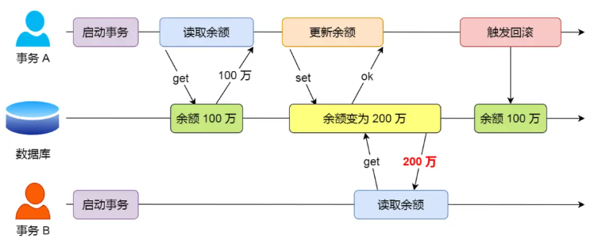
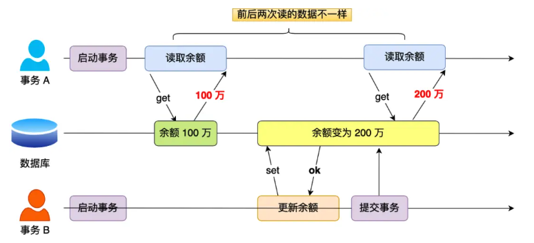
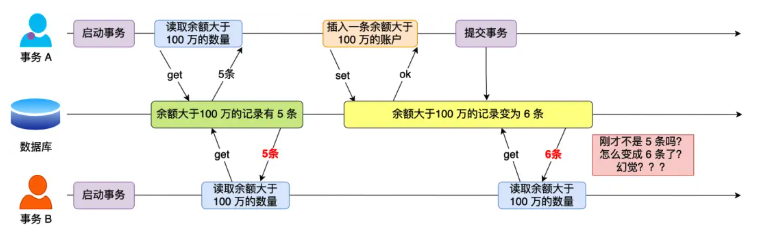
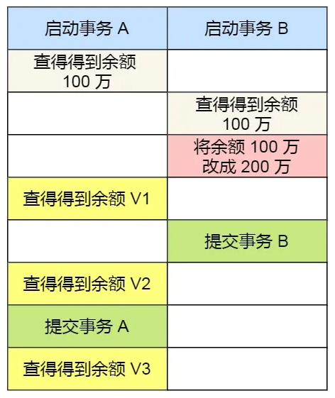

import Highlight from '@site/src/components/Highlight'
import Warn from '@site/src/components/Warn'
import Term from '@site/src/components/Term'

# Transactional 

### 1. What concurrency-related issues might MySQL encounter?
- MySQL server allows multiple client connections, meaning it handles multiple transactions simultaneously.
- Issue like **dirty read**, **non-repeatable read**, **lost update**, and **phantom read** may occur.

#### <Term>Dirty Read</Term>

- If a transaction **reads data modified by another uncommitted transaction**, it means a dirty read has occurred.
- Potentially leading to inconsistent or incorrect data.
- Because Transaction A is uncommitted, it may roll back at any time. If Transaction A rolls back in the scenario described, the data read by Transaction B becomes outdated. This phenomenon is called a dirty read.

#### <Term>Non-Repeatable Read</Term>

- Scope: Specific row
- If a transaction reads the same data multiple times and the **data differs between reads**, it means a non-repeatable read has occurred.

#### <Term>Phantom Read</Term>

- Scope: Set of rows
- If a transaction queries the "number of records" meeting a certain condition multiple times and **the number of records differs between queries**, it means a phantom read has occurred.
- Transaction A starts by querying the database for accounts with a balance greater than 1 million and finds 5 records. Transaction B, using the same search condition, also queries and finds 5 records.
- Next, Transaction A inserts a new account with a balance exceeding 1 million and commits the transaction, increasing the number of accounts with a balance over 1 million to 6.
- Then, Transaction B queries again for accounts with a balance greater than 1 million and now finds 6 records, which differs from the previous query's result. This **creates the illusion of a "phantom" change**, and this phenomenon is called a phantom read.

### 2. What scenario can't tolerate Dirty Read?
1. Banking Systems: Financial transactions demand precise and consistent data. A dirty read could result in incorrect balance information, leading to errors in account management or customer-facing applications.
2. Inventory Management Systems: Accurate stock levels are critical for operational efficiency. Dirty reads could cause incorrect inventory counts, leading to overselling or stockouts.
3. Online Order Systems: Order processing requires consistent state information. A dirty read could display incorrect order statuses to customers, causing confusion or incorrect order fulfillment.

### 3. How MySQL handles concurrency issues?
#### Locking Mechanisms
1. Various locks: row-level locks, table-level locks, and page-level locks.
2. By locking data during read or write operations, these mechanisms ensure that only one operation can access or modify the data at a time.

#### Transaction Isolation Levels
1. Multiple isolation levels: Read Uncommitted, Read Committed, Repeatable Read, Serializable.

#### MVCC (Multi-Version Concurrency Control)
1. Uses MVCC to manage concurrent access. It maintains different versions of data in the database to achieve isolation between transactions. 
2. When reading data, MySQL selects the appropriate data version based on the transaction’s isolation level, ensuring data consistency.

### 4. What are the transaction isolation levels?
- Listed from lowest to highest:
    1. <Term>Read Uncommitted</Term>
        1. A transaction can read uncommitted data from other transactions.
        2. Leads to dirty reads, non-repeatable reads, and phantom reads.
    2. <Term>Read Committed</Term>
        1. A transaction can only read data that has been committed by other transactions.
        2. Prevent dirty reads, but may still have non-repeatable reads and phantom reads.
    3. <Term>Repeatable Read</Term>
        1. Multiple reads of the same data within the same transaction yield consistent results
        2. Prevent dirty reads and non-rearepeatable reads, but may still have phantom reads.
        3. Default isolation level for MySQL's InnoDB engine.
    4. <Term>Serializable</Term>
        1. Transactions are executed completely sequentially.
        2. Prevents dirty reads, non-repeatable reads, and phantom reads.
        3. But with the lowest concurrency performance.

- Specific example to illustrate the four isolation levels:
    - Two concurrent transactions are involved: Transaction A is only responsible for querying the balance, while Transaction B changes the balance to 2 million. Below is the behavior of the two transactions executed in chronological order:
    
    - The balance queried during transaction A execution will be different at different isolation levels.
        1. **Read Uncommitted**: V1, V2 and V3 are 2million.
        2. **Read Committed**: V1 is 1million, V2 and V3 are 2million.
        3. **Repeatable Read**: V1 and V2 are 1million, V3 is 2million.
        4. **Serializable**: V1, V2 and V3 are 1million.
            - Transaction B is blocked because Transaction A is still running.
    
### 5. How above transaction isolation levels are achieved in MySQL?
1. **Read Uncommitted**: Since the data modified by the uncommitted transaction can be read, so just read the latest data directly.
2. **Serializable**: By adding read/write locks.
3. **Read Committed** && **Repeatable Read**: 
    1. Implemented through <Term>Read View</Term>.
    2. Difference: Read View is created at different times
    3. Read View: A snapshot of data at a specific time.
    4. **Read Committed**: Before the execution of statement.
    5. **Repeatable Read**: When the transaction starts, then use this Read View throughout the transaction.