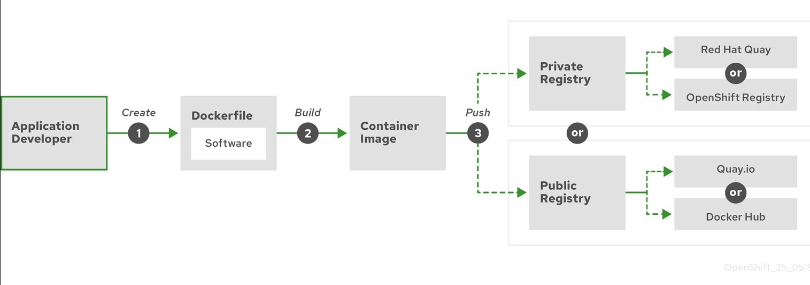

# Docker

### 1. What is Docker, and how does it differ from a virtual machine?
1. Docker: Containeriation platform that packages applications and their dependencies into lightweight containers.
2. Unlike VM, which include a full OS and emulate hardware using a hypervisor, Docker containers share the host's OS kernel, making them faster, and more resources efficient.
3. Containers enable consistent environments across development, testing, and production.

### 2. What is a Docker image, and how is it different from a Docker container?
- Docker Image
    1. Template for create Docker containers.
    2. Include everything needed to run an application, including libraries, configuration, and dependencies.
- Docker Container
    1. Instance of a Docker image.
    2. Isolated and self-contained environment where your application can run without conflicts with other software on the host system.

### 3. Explain the Docker architecture and its main components.
- Docker’s architecture follows a client-server model. The main components are:
    1. Docker Client: Sends commands (e.g., docker run) to the Docker Daemon via CLI or API.
    2. Docker Daemon: Runs on the host, managing images, containers, networks, and storage.
    3. Docker Images: Templates for creating containers, stored locally or in registries.
    4. Containers: Runnable instances of images.
    5. Docker Registry: Stores and distributes Docker images.

### 4. What is a Dockerfile, and what are some common instructions used in it?
- Dockerfile is a script with instruction to build a Docker image.
    1. `FROM`: Set the base image, e.g., `FROM
    2. `RUN`: Execute commands during building, e.g.,
    3. `COPY`: Copy files from the host to the container, e.g.,
    4. `CMD`: Set the command to run when the container starts, e.g.,
    5. `EXPOSE`: Publish a container's port to the host, e.g.,

``` bash title="Dockerfile in Spring Boot Application"
FROM nexus.xxxx.com:8443/repository/xxxx-docker-release/openjre-21:1.0-0
COPY target/app.jar /app/app.jar
COPY config /app/config
ENTRYPOINT ["summon", "-f", "/etc/summon/secrets.yml", "java", "-jar", "/app/app.jar"]
EXPOST 8080
```

### 5. How do you manage persistent data in Docker containers?

### 6. What is Docker Compose, and when would you use it?
- A tool for defining and running multi-container Docker applications using YAML file.
- It specifics servicem, network, and volumes.
- Run with command `docker-compose up`
- Normally use it in development environment.

### 7. How do you optimize a Docker image for production?
1. Use a minimal base image, like `alpine`, to reduce size.
2. Minimize layers by combining commands into a single layer, like `RUN apt-get update && apt-get install`.
3. Remove unnecessary files and folders, like `/tmp`, `/var/tmp`, `/var/log`, `/var/cache`.
4. Scan images for vulnerabilities using a tool like `docker scan`.

### 8. What are Docker networks, and what are the different types?
- Enable communication between containers and host in Docker network.
- The main types are:
    1. Bridge: Default network, isolates containers on a private network with port mapping.
    2. Host: Containers share the host's network stack, removing isolation for better performance.
    3. Overlay: Enables communication across multiple hosts, used in Docker Swarm for distributed apps.
    4. None: Disables networking for isolated containers.
- For instance, could use bridge network to connect frontend and backend container on the same host.

### 9. How do you handle security in Docker?
1. Run containers as non-root users by setting `USER` in the Dockerfile.
2. Limit container privileges with --cap-drop or seccomp profiles.

### 10. How would you troubleshoot a container that fails to start?
1. Check logs with `docker logs <container_id>` to identify errors, like missing dependencies.
2. Inspect the container’s state with `docker inspect <container_id>` to verify configuration, such as ports or volumes.
3. Confirm resource availability, like memory or disk space, using docker info.

### 11. Common Docker command.
- Container:
    1. `docker run -d -p 8080:80 <image_name>`: Run the image in detached mode and mapping port 8080 to port 80.
    2. `docker ps -a`: List all conatiner include stopped.
    3. `docker stop <container_name>`
    4. `docker start <container_name>`
    5. `dokcer restart <container_name>`
    6. `docker rm <container_name>`
    7. `docker exec -it <container_name> /bin/bash`: Execute a command in a running container, `-it` means interactive mode.
    8. `docker logs <container_name>`: View the logs of a container.
- Image:
    1. `docker pull ubuntu:20.04`
    2. `docker build -t my_app:1.0`
    3. `docker images`
    4. `docker rmi`
    5. `docker tag my_app:1.0 my_app:latest`
    6. `docker push my_app:1.0`
- Network & Volume:
    1. `docker network ls`
    2. `docker network create my_network`
    3. `docker volume ls`: Display available volume for persistent storage.
    4. `docker volume create my_volume`: Create a new volume.
- Docker Compose
    1. `docker-compose up -d`
    2. `docker-compose down`: Cleans up all resources created by `docker-compose up`.
- System & Info.
    1. `docker info`
    2. `docker version`
    3. `docker system prune -a`: Removes unused containers, networks, images, and build cache.
- Troubleshooting & Inspection
    1. `docker inspect my_container`
    2. `docker stats`: Displays real-time resource usage statistics for all running containers.

### 12. Flow to build container.


1. Create Dockerfile in project root directory.
    - To state the base image, expose ports.
2. Run `docker build -t <image_name> .`
3. Tag and push to registry.
    - `docker push`
4. Pull and run the image by `docker run`

