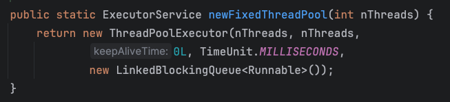

import Highlight from '@site/src/components/Highlight'
import Warn from '@site/src/components/Warn'
import Term from '@site/src/components/Term'

# Multi-Threading

### 1. Ways to create multi-threads
    - <Term>Extends Thread class</Term>
      ```java 
        class MyThread extends Thread {
          @Override
          public void run() {
            System.out.println("Hello");
          }
        }

        public static void main(String[] args) {
          MyThread t = new MyThread();
          t.start();
        }
      ```
      - Pros:
        1. Simple to write
        2. When needing to access the current thread, you can directly use `this` without calling `Thread.currentThread()`
      - Cons:
        1. Since the thread class already inherits from `Thread`, it cannot inherit from any other parent class
    - <Term>Implements Runnable interface</Term>
      ```java
        class MyRunnable implements Runnable {
          @Override
          public void run() {
            System.out.println("MyRunnable");
          }
        }

        public static void main(String[] args) {
          Thread t = new Thread(new MyRunnable());
          t.start();
        }
      ```
      - Pros:
        1. The thread class only implements `Runnable` interface, allowing it to inherit from other classes.
        2. Multiple threads can share the same target object, making it highly suitable for scenarios where multiple threads.need to access the same resource.
      - Cons:
        1. Slightly more complex.
        2. If you need to access the current thread, you must use `Thread.currentThread()`.
        3. Cannot return a result.

    - <Term>Implement Callable interface and FutureTask</Term>
      - `java.util.concurrent.Callable` interface is similar to `Runnable`, but the `call()` method returns a result and thorw exceptions.
      - To execute `Callable` task, it needs to be wrapped in a `FutureTask` object because the constructor of `Thread` class takes a `Runnable` object, and `FutureTask` implements `Runnable` interface.
      ```java
        class MyCallable implements Callable<String> {
          @Override
          public String call() throws Exception {
            return "Hello World";
          }
        }

        public static void main(String[] args) {
          MyCallable myCallable = new MyCallable();
          FutureTask<String> futureTask = new FutureTask<>(myCallable);
          Thread t = new Thread(futureTask);
          t.start();

          try {
            String res = futureTask.get();
            System.out.println("Result: " + res);
          } catch (InterruptedException | ExecutionException e) {
            e.printStackTrace();
          }
        }
      ```
      - Pros
        1. Same as `Runnable`.
      - Cons
        1. Same as `Runnable`.
    - <Term>Extends ExecutorService</Term>
      - Starting from Java5, `java.util.concurrent.ExecutorService` introduced support for thread pools.
      - A way more efficient to manage threads, avoiding the overhead of creating and destroying threads.
      - Different types of thread pools can be created using the static methods of the `Executors` class.
        
      ```java
        class Task implements Runnable {
          @Override
          public void run() {
            System.out.println("Task start");
          }
        }

        ExecutorService executor = Executors.newFixedThreadPool(10);
        for(int i = 0; i < 100; i++) {
          executor.submit(new Task());
        }
        executor.shutdown();
      ```
      - Pros
        1. Can **resue pre-created threads**, avoiding the overhead of thread creation and destruction.
        2. For concurrent requests requiring quick responses, thread pools can rapidly provide threads to handle the tasks, reducing wait time.
        3. Thread pools can control the number of running threads, preventing system resource exhausion due to creating too many threads.
        4. By properly configuring the thread pool size, CPU utilization and system throughput can be optimized.
      - Cons
        1. Increase program complexity, especially in tuning thread pool parameters and troubleshooting issues.
        2. Incorrect configurations may lead to problems such as deadlocks or resource exhaustion.

### 2. How to prevent deadlocks?
- A deadlock occurs only when the following four conditions are simultaneously met:
  1. Mutual Exclusion: **Multiple threads cannot use the same resource simulatenously.**
  2. Hold and Wait: Refers to situation where Thread A, which already holds Resource 1, want to acquire Resource 2. However, Resource 2 is held by Thread B, so Thread A enters a waiting state. While **Thread A is waiting for Resource 2, Thread A does not release Resource 1.**
  3. No Preemption Condition: Once a thread holds a resource, it **cannot be taken away by other threads until the thread releases the resource voluntarily**. If Thread B wants to use this Resource 1, it can only acquire it after Thread A has finished using and released it.
  4. Circular Wait Condition: During a deadlock, the order in which **two or more threads acquire resources forms a circular chain.**
  ```java title="Deadlock Example"
    private static final Object resource1 = new Object();
    private static final Object resource2 = new Object();

    Thread threadA = new Thread(() -> {
      // highlight-next-line
      synchronized (resource1) {
        System.out.println("Thread A acquired resource1");
        try {
          Thread.sleep(100);
        } catch (InterruptedException e) {
          e.printStackTrace();
        }
        synchronized (resource2) {
          System.out.println("Thread A acquired resource2");
        }
      }
    });

    Thread threadB = new Thread(() -> {
      // highlight-next-line
      synchronized (resource2) {
        System.out.println("Thread B acquired resource2");
        try {
          Thread.sleep(100);
        } catch (InterruptedException e) {
          e.printStackTrace();
        }
        synchronized (resource1) {
          System.out.println("Thread B acquired resource1");
        }
      }
    });

    thread1.start();
    thread2.start();

    // Output: Thread 1 acquired resource1
    // Output: Thread 2 acquired resource2
  ``` 

- Most common approach: <Term>Resource Ordering Allocation Method</Term>
  - To break the circular wait condition.
  - Thread A and Thread B must acquire resources in the same order. When Thread A attempts to acquire Resource A first and then Resource B, Thread B must also attempt to acquire Resource A first and then Resource B.


### 3. What are the differences and similarities between `wait` and `sleep` in Java?
#### Class
1. `sleep`: static method that is defined in the `Thread` class
2. `wait`: instance method that is defined in the `Object` class

#### Lock Release Behavior
1. `Thread.sleep()`: When called, the thread pauses execution for the specified time but does not release any object locks it holds.
2. `Object.wait()`: When called, the thread releases the object lock it holds and enters a waiting state until another thread calls `notify()` or `notifyAll()` on the same object to wake it up.

#### Usage Condition
1. `sleep`: Can be called anywhere without the need to acquire a lock beforehand.
2. `wait`: must be called within a synchronized block or synchronized method (i.e., the thread must hold the object’s lock); otherwise, it throws an IllegalMonitorStateException.

#### Wake-up Mechanism
1. `sleep`: After the specified sleep duration ends, the thread automatically returns to the runnable state, awaiting CPU scheduling.
2. `wait`: The thread remains in the waiting state until another thread calls notify() or notifyAll() on the same object to wake it up. `notify()` randomly wakes up one thread waiting on the object, while `notifyAll()` wakes up all threads waiting on the object.


### 4. What are the statuses of a thread?
- `java.lang.Thread.State` enum class defines six thread states. You can call `getState()` method on a `Thread` object to get the current state of the thread.

  | State          | Description                                                                 |
  |----------------|-----------------------------------------------------------------------------|
  | NEW            | The thread has not yet started, i.e., it has been created but **the `start` method has not been called.**  |
  | RUNNABLE       | The thread is in the **ready state** (after calling `start`, awaiting scheduling) or **actively running.** |
  | BLOCKED        | The thread is blocked, **waiting to acquire a monitor lock** to enter a synchronized block or method.      |
  | WAITING        | The thread is in a waiting state, **waiting for another thread** to perform a specific action (e.g., `Object.notify()`). |
  | TIMED_WAITING  | The thread is in a waiting state with a **specified timeout.**              |
  | TERMINATED     | The thread has completed execution and is in a **terminated state.**        |

### 5. Describe the lifecycle of a Java thread?
- The lifecycle of a thread is divided into five states:
  1. New: The thread has just been created using the `new` method but has not yet started.
  2. Runnable: After calling the `start()` method, the thread is in a state where it is waiting for CPU resources to be allocated.
  3. Running: When a runnable thread is scheduled and obtains CPU resources, it enters the running state.
  4. Blocked: While in the running state, a thread may enter a blocked state due to certain reasons, such as calling `sleep()` or `wait()`. Woken threads do not immediately execute the `run` method; they must wait again for CPU resource allocation to re-enter the running state.
  5. Terminated: If the thread completes execution normally, is forcibly terminated prematurely, or ends due to an exception, the thread is destroyed, releasing its resources.

### 6. How do different threads communicate with each other? 
1. Shared variables `volatile`
    1. Multiple threads can access and modify the same shared variable to exchange information.
    2. To ensure thread safety, it is necessary to use `synchronized` or `volatile` keyword.

    ```java title="Multiple Threads - Volatile"
      private static volatile boolean flag = false;

      public static void main(String[] args) {
        Thread producer = new Thread(() -> {
          try {
            Thread.sleep(2000);
          } catch (InterruptedException e) {
            e.printStackTrace();
          }

          flag = true;
          System.out.println("Producer: Flag is set to true.");
        });

        Thread consumer = new Thread(() -> {
          // highlight-next-line
          while (!flag) {
          }
          System.out.println("Consumer: Flag is now true.");
        });

        producer.start();
        consumer.start();
      }
    ```

2. `wait()`, `notify()`, and `notifyAll()` methods in `Object` class
    1. The `wait()` method causes the current thread to enter a waiting state.
    2. The `notify()` method wakes up a single thread that is waiting on this object's monitor.
    3. The `notifyAll()` method wakes up all threads that are waiting on this object's monitor.

    ```java
      class WaitNotifyExample {
        private static final Object lock = new Object();

        public static void main(String[] args) {
          // Thread producer
          Thread producer = new Thread(() -> {
            synchronized (lock) {
              try {
                System.out.println("Producer: Producing...");
                Thread.sleep(2000); // Simulate production time
                System.out.println("Producer: Production finished. Notifying consumer");
                // Notify waiting threads
                //highlight-next-line
                lock.notify();
              } catch (InterruptedException e) {
                e.printStackTrace();
              }
            }
          });

          // Thread consumer
          Thread consumer = new Thread(() -> {
            synchronized (lock) {
              try {
                System.out.println("Consumer: Waiting for production to finish...");
                // Wait for notification
                //highlight-next-line
                lock.wait();
                System.out.println("Consumer: Production finished. Consuming...");
              } catch (InterruptedException e) {
                e.printStackTrace();
              }
            }
          });

          consumer.start();
          producer.start();
        }
      }
    ```

3.  `Lock` and `Condition` interfaces
    1. More flexible appraoch compared to `synchronized`
    2. The `await()` method of the `Condition` interface is similar to the `wait()` method.
    3. The `signal()` is similar to the `notify()` method.
    4. The `signalAll()` is similar to the `notifyAll()` method.
    5. The `ReentrantLock` class implements the `Lock` interface.

    ```java
      private static final Lock lock = new ReentrantLock();
      private static final Condition condition = lock.newCondition();

      public static void main(String[] args) {
      // Producer thread
        Thread producer = new Thread(() -> {
          lock.lock();
          try {
            System.out.println("Producer: Producing...");
            Thread.sleep(2000); // Simulate production time
            System.out.println("Producer: Production finished. Notifying consumer...");
            // Notify waiting threads
            condition.signal();
          } catch (InterruptedException e) {
            e.printStackTrace();
          } finally {
            lock.unlock();
          }
        });

        // Consumer thread
        Thread consumer = new Thread(() -> {
          lock.lock();
          try {
            System.out.println("Consumer: Waiting for production to finish...");
            // Wait for notification
            condition.await();
            System.out.println("Consumer: Production finished. Consuming...");
          } catch (InterruptedException e) {
            e.printStackTrace();
          } finally {
            lock.unlock();
          }
        });

        consumer.start();
        producer.start();
      }
    ```

4. `BlockingQueue` Interface
    1. Thread-safe queue operations.
    2. When the queue is full, threads attempting to insert elements will be blocked.
    3. When the queue is **empty**, threads attempting to **retrieve elements will be blocked**.

    ```java
      private static final BlockingQueue queue = new LinkedBlockingQueue<>(1);

      public static void main(String[] args) {

        // Producer thread
        Thread producer = new Thread(() -> {
          try {
            System.out.println("Producer: Producing...");
            queue.put(1); // Blocks if queue is full
            System.out.println("Producer: Production finished.");
          } catch (InterruptedException e) {
            e.printStackTrace();
          }
        });

        // Consumer thread
        Thread consumer = new Thread(() -> {
          try {
            System.out.println("Consumer: Waiting for production to finish...");
            int item = (int) queue.take(); // Blocks if queue is empty
            System.out.println("Consumer: Consumed item: " + item);
          } catch (InterruptedException e) {
            e.printStackTrace();
          }
        });

        consumer.start();
        producer.start();
      }
    ```


### 7. What are the methods for inter-thread communication?

### 8. How many threads should a program open?


### 9. Describe the differences between `sleep()` and `wait()`?
- `sleep()`: `Thread` class, pauses the current thread for a specified time.
- `wait()`: `Object` class, waits for another thread to notify.

### 10. Describe the differences between `notify()` and `notifyAll()`?
- `notify()`: Wakes up one thread waiting on the object’s monitor.
- `notifyAll()`: Wakes up all threads waiting on the object’s monitor

### 11. What is the difference between the `run()` and `start()` methods of a thread?

