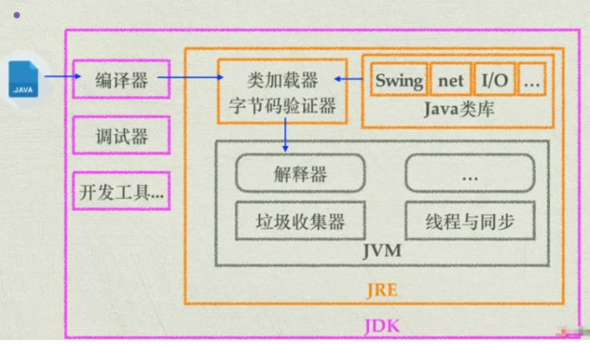

import Highlight from '@site/src/components/Highlight'
import Warn from '@site/src/components/Warn'
import Term from '@site/src/components/Term'

# Background

#### 1. Characteristics of Java
    1. Platform Independece
        1. The Java compiler translates source code into bytecode, which can run on any system equipped with a JVM.
    2. Object Oriented
        1. Everything in Java is an object.
        2. Class, Object, Inheritance, Polymorphism, Encapsulation
    3. Memory Management
        1. Has garbage collection mechanism, which automatically manages memory and reclaims objects that are no longer in use.

#### 2. Why Java is cross-platform?
    1. After compilation, Java generates a .class file, known as a bytecode file.
    2. JVM translates the bytecode into machine code specific to the taret platform and then executing it.

#### 3. Relationship of JVM, JDK, JRE?
    
    ##### <Term>JVM</Term>
    1. Responsible interpreting or **compiling Java bytecode (generated by the Java compiler) into machine code**.
    2. Execute the program.
    3. Provide features such as memory management, garbage collection.

    #### <Term>JRE</Term>
    1. Is the minimum environment required to run Java programs.
    2. Include the JVM and a set of Java class libraries to support the execution of Java programs.
    3. **Does not include tools for compileing or developing Java code** and only provides the runtime environment needed to execute Java programs.

    ##### <Term>JDK</Term>
    1. A collection of tools required for developing Java programs.
    2. Includes the JVM, compiler (javac), debugger (jdb), Java standard library
    3. Provide all the tools and environments needed for developing, compiling, debugging, and running Java programs.

#### 4. Difference between Java and Python
    1. Java is a compiled programming language where the Java compiler translates source code into bytecode, which is then executed by the JVM.
    2. Python is an interpreted language where translation occurs simultaneously as the program is executed.
