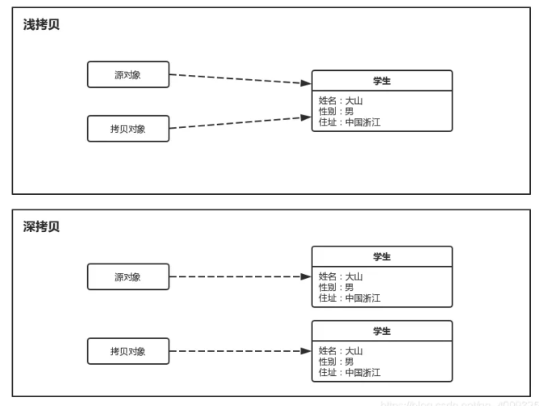

import Highlight from '@site/src/components/Highlight'
import Warn from '@site/src/components/Warn'
import Term from '@site/src/components/Term'

# Basic

### Object
#### 1. What is the difference between `==` and `equals`?
1. For string variables
    1. `==` compares whether the **memory addresses (in the heap)** of two strings are numerically equal, which is a value comparison.
    2. `equals` compares whether the contents of the strings are the same.
2. For non-string variables
    1. if the equals() method is not overridden, the behavior of `==` and `equals` is the same.
    2. Both are used to **compare the memory addresses of objects** in the heap, i.e., to determine whether two reference variables point to the same object.

#### 2. What is the relationship between `hashCode` and `equals` methods?
    - For a class that overrides the `equals` method, it is typically necessary to override the `hashCode` method as well, adhering to the following rules:
        - Consistency:
            1. If two objects are considered equal when compared using the `equals` method, i.e. `obj1.equals(obj2)` returns `true`.
            2. Then they must have the same hash code, i.e. `obj1.hashCode() == obj2.hashCode()`.
        - Non-Consistency:
            1. If two objects have the same `hashCode` value, it does not necessarily mean that comparing them with the `equals` method will return `true`.
            2. if `obj1.hashCode() == obj2.hashCode()`, `obj1.equals(obj2)` might be `false`.

    - When overriding the equals method, it is essential to override the hashCode method.

#### 3. Differences and Relationships Between `String`, `StringBuffer`, and `StringBuilder`
    - Mutability
        - `String` is immutable; once created, its content cannot be modified, and any modification results in a new object being generated.
        - `StringBuilder` and `StringBuffer` are mutable; they allow direct modification of string content without creating new objects.
    - Thread Safety
        - `String` is inherently thread-safe due to its immutability.
        - `StringBuilder` is not thread-safe, making it suitable for single-threaded environments.
        - `StringBuffer` is thread-safe, with its methods synchronized using the synchronized keyword, making it appropriate for multi-threaded environments.
    - Performance
        - `String` has the lowest performance, especially when frequently modified, as it generates numerous temporary objects, increasing memory overhead and garbage collection pressure.
        - `StringBuilder` offers the highest performance since it lacks thread-safety overhead, making it ideal for string operations in single-threaded contexts.
        - `StringBuffer` has slightly lower performance than StringBuilder due to the synchronization overhead introduced by its thread-safety mechanism.
    - Usage Scenarios
        - Use `String` if the string content is fixed or rarely changes.
        - Use `StringBuilder` if frequent string modifications are needed in a single-threaded environment.
        - Use `StringBuffer` if frequent string modifications are required in a multi-threaded environment.

    | Feature      | String         | StringBuilder   | StringBuffer   |
    |--------------|----------------|-----------------|----------------|
    | Immutability | Immutable      | Mutable         | Mutable        |
    | Thread Safety| Yes (due to immutability) | No         | Yes (synchronized methods) |
    | Performance  | Low (when frequently modified) | High (single-threaded) | Medium (thread-safe for multi-threading) |
    | Usage Scenario | Static strings | Dynamic strings in single-threaded | Dynamic strings in multi-threaded |

### Shallow Copy and Deep Copy
#### 1. Difference between shallow copy and deep copy.
    
    1. <Term>Shallow Copy</Term>
        1. Create a new object.
        2. Does not copy the reference-type fields within the object.
        3. Original object and the new object points to the same referenced object.
        4. If the fields are primitive type (e.g. `int`, `double`), their value are copied.
        5. If the fields are reference type (e.g. `String`, `ArrayList`), their reference is copied.

    2. <Term>Deep Copy</Term>
        1. Create a new object.
        2. Copy all reference-type fields within the object.
        3. The original and the copy have no shared references.

#### 2. How to implement deep copy?
- Implementing the Cloneable Interface and Overriding the clone() Method
    - This method requires the object and all its reference-type fields to implement the Cloneable interface and override the clone() method.
    ```java
        class MyClass implements Cloneable {
            private String field1;
            private NestedClass nestedObject;

            @Override
            protected Object clone() throws CloneNotSupportedException {
                MyClass cloned = (MyClass) super.clone();
                cloned.nestedObject = (NestedClass) nestedObject.clone(); // 深拷贝内部的引用对象
                return cloned;
            }
        }

        class NestedClass implements Cloneable {
            private int nestedField;

            @Override
            protected Object clone() throws CloneNotSupportedException {
                return super.clone();
            }
        }
    ```

### Exception
#### 1. Introduce Java Exception
- Is primarily based on two main categories: the `Throwable` class and its subclasses.
- `Throwable` has two important subclasses: `Error` and `Exception`

- <Term>Error</Term>
    1. Errors in the runtime environment.
    2. Severe issues that a program cannot handle, such as system crashes, virtual machine errors.
    3. Examples include `OutOfMemoryError` and `StackOverflowError`.

- <Term>Exception</Term>
    1. Exceptional conditions that the program itself can handle.
        1. <Term>Non-Runtime Exceptions</Term>
            1. These exceptions must be caught or declared to be thrown at compile time.
            2. Are typically caused by external errors, such as a file not found (`FileNotFoundException`) or a class not found (`ClassNotFoundException`).
        2. <Term>Runtime Exceptions</Term>
            1. Include runtime exceptions (RuntimeException) and errors.
            2. Are caused by programming errors, such as null pointer access (`NullPointerException`) or array out-of-bounds errors (`ArrayIndexOutOfBoundsException`).
            3. Runtime exceptions do not need to be caught or declared at compile time.

#### 2. What are the methods of exception handling in Java?
    - try-catch Block
    - `throw` Statement
        - Used to manually throw an exception.
    - `throws` Keyword
        - If a method might throw an exception but the exception is not handled within the method, the throws keyword can be used to pass the exception to the caller for handling.
        ```java
        public void methodName() throws ExceptionType {
            // Method body
        }
        ```
    - `finally` Block
        - Executes regardless of whether an exception occurs. It is typically used to release resources and ensure proper resource cleanup.

### Java New Feature
#### 1. Tell me some new features in Java 8.
    | Feature Name            | Description                                      | Example or Explanation                                      |
|--------------------------|--------------------------------------------------|-------------------------------------------------------------|
| Lambda Expressions       | Simplify anonymous inner classes, support functional programming | `(a, b) -> a + b` replaces anonymous class implementing an interface |
| Functional Interfaces    | Interfaces with a single abstract method, marked with `@FunctionalInterface` annotation | `Runnable`, `Comparator`, or custom `@FunctionalInterface interface MyFunc { void run(); }` |
| Stream API              | Provides **chained operations for collection data**, supports parallel processing | `list.stream().filter(x -> x > 0).collect(Collectors.toList())` |
| Optional Class           | **Encapsulates potentially null objects**, reduces null pointer exceptions | `Optional.ofNullable(value).orElse("default")` |
| Method References        | Simplify Lambda expressions by directly referencing existing methods | `System.out::println` is equivalent to `x -> System.out.println(x)` |
| Default and Static Methods in Interfaces | Interfaces can define default implementations and static methods, enhancing extensibility | `interface A { default void print() { System.out.println("Default method"); } }` |
| Parallel Array Sorting   | Uses multithreading to accelerate array sorting  | `Arrays.parallelSort(array)` |
| Repeated Annotations     | Allows the same annotation to be used multiple times at the same location | `@Repeatable` annotation used with container annotations |
| Type Annotations         | Annotations can be applied to more locations (e.g., generics, exceptions) | `List<@NonNull String> list` |
| CompletableFuture        | Enhances asynchronous programming with **chained calls** and composite operations | `CompletableFuture.supplyAsync(() -> "result").thenAccept(System.out::println)` |

#### 2. How to implement `CompletableFuture`
    - Introduced in Java 8.
    - Prior to Java 8, asynchronous operations were typically implemented using `Future` or Guava's `ListenableFuture`.
    ```java
        ExecutorService executor = Executors.newFixedThreadPool(5);
        CompletableFuture<String> cf1 = CompletableFuture.supplyAsync(() -> {
            System.out.println("执行step 1");
            return "step1 result";
        }, executor);
        CompletableFuture<String> cf2 = CompletableFuture.supplyAsync(() -> {
            System.out.println("执行step 2");
            return "step2 result";
        });
        cf1.thenCombine(cf2, (result1, result2) -> {
            System.out.println(result1 + " , " + result2);
            System.out.println("执行step 3");
            return "step3 result";
        }).thenAccept(result3 -> System.out.println(result3));
    ```

    - `CompletableFuture` implements two interfaces: `Future` and `CompletionStage`.
        - `Future` represents the result of an asynchronous computation.
        - `CompletionStage` represents a stage in the asynchronous execution process, which may be triggered by another `CompletionStage`. As the current stage completes, it may also trigger the execution of a series of other `CompletionStage` instances.
    - Allows for diverse orchestration and combination of these stages based on actual business needs.
    - We can use its provided functional programming methods, such as `thenApply` and `thenCompose`, to compose and orchestrate these stages.

#### 3. Do you understand Lambda expressions?
- Used to create anonymous functions, primarily designed to simplify the use of functional interfaces (interfaces with a single abstract method)
- It has two basic syntax forms:
    1. `(parameters) -> expression`: Used when the Lambda body consists of a **single expression**. The result of the expression serves as the return value.
    2. `(parameters) -> { statements; }`: Used when the Lambda body contains multiple statements. Curly braces are required to enclose the statements, and if there is a return value, a return statement must be used.
- The traditional anonymous inner class implementation tends to be verbose, whereas Lambda expressions can achieve the same functionality with a more concise syntax. For example, implementing the `Runnable` interface can be done in both ways:
    1. Using Anonymous Inner Class
        ```java
        public class AnonymousClassExample {
            public static void main(String[] args) {
                Thread t1 = new Thread(new Runnable() {
                    @Override
                    public void run() {
                        System.out.println("Running using anonymous class");
                    }
                });
                t1.start();
            }
        }
        ```
    2. Using Lambda Expression
        ```java
        public class LambdaExample {
            public static void main(String[] args) {
                Thread t1 = new Thread(() -> System.out.println("Running using lambda expression"));
                t1.start();
            }
        }
        ```

- Additionally, Lambda expressions can more clearly express the intent of the code, especially when handling collection operations such as filtering, mapping, etc. For example, filtering a list to get all even numbers:
    ```java
    import java.util.Arrays;
    import java.util.List;
    import java.util.stream.Collectors;

    public class ReadabilityExample {
        public static void main(String[] args) {
            List<Integer> numbers = Arrays.asList(1, 2, 3, 4, 5, 6);
            // Using Lambda expression with Stream API to filter even numbers
            List<Integer> evenNumbers = numbers.stream()
                                            .filter(n -> n % 2 == 0)
                                            .collect(Collectors.toList());
            System.out.println(evenNumbers); // Output: [2, 4, 6]
        }
    }
    ```
- Furthermore, Lambda expressions enable Java to support the functional programming paradigm, allowing functions to be passed as parameters. This enables the creation of more flexible and reusable code. For example, defining a generic calculation function:
    ```java
    interface Calculator {
        int calculate(int a, int b);
    }

    public class FunctionalProgrammingExample {
        public static int operate(int a, int b, Calculator calculator) {
            return calculator.calculate(a, b);
        }

        public static void main(String[] args) {
            // Passing addition function using Lambda expression
            int sum = operate(3, 5, (x, y) -> x + y);
            System.out.println("Sum: " + sum); // Output: Sum: 8

            // Passing multiplication function using Lambda expression
            int product = operate(3, 5, (x, y) -> x * y);
            System.out.println("Product: " + product); // Output: Product: 15
        }
    }
    ```
- Drawback:
    1. Increase debugging difficulty because Lambda expressions are **anonymous**, making it challenging to pinpoint which specific Lambda expression is causing an issue


#### 4. Tell me some new featuers in Java 21.
1. Pattern Matching for Switch Statement
    1. `case SavingsAccount sa -> result = sa.getSavings();`
        ```java title="Before Java 21"
            public class SwitchBeforeJava21 {
                static String processAccount(Object account) {
                    String result;
                    if (account instanceof SavingsAccount) {
                        SavingsAccount sa = (SavingsAccount) account;
                        result = "Savings Balance: " + sa.getSavings();
                    } else if (account instanceof CheckingAccount) {
                        CheckingAccount ca = (CheckingAccount) account;
                        result = "Checking Balance: " + ca.getChecking();
                    } else if (account == null) {
                        result = "Account is null";
                    } else {
                        result = "Unknown account type";
                    }
                    return result;
                }

                public static void main(String[] args) {
                    SavingsAccount savings = new SavingsAccount(1000);
                    CheckingAccount checking = new CheckingAccount(500);
                    System.out.println(processAccount(savings));  // Output: Savings Balance: 1000
                    System.out.println(processAccount(checking)); // Output: Checking Balance: 500
                    System.out.println(processAccount(null));     // Output: Account is null
                }
            }
        ```
        ```java title="In Java 21"
            public class SwitchInJava21 {
                static String processAccount(Object account) {
                    return switch (account) {
                        case SavingsAccount sa -> "Savings Balance: " + sa.getSavings();
                        case CheckingAccount ca -> "Checking Balance: " + ca.getChecking();
                        case null -> "Account is null";
                        default -> "Unknown account type";
                    };
                }

                public static void main(String[] args) {
                    SavingsAccount savings = new SavingsAccount(1000);
                    CheckingAccount checking = new CheckingAccount(500);
                    System.out.println(processAccount(savings));  // Output: Savings Balance: 1000
                    System.out.println(processAccount(checking)); // Output: Checking Balance: 500
                    System.out.println(processAccount(null));     // Output: Account is null
                }
            }
        ```
2. Array Patterns
    1. For instance, `if (arr instanceof int[] {1, 2, 3})`
3. String Templates
    1. Previously, `"hello " + name + ", welcome to the geeksforgeeks!"`, In Java 21, this can be simplified to `hello {name}, welcome to the geeksforgeeks!`.