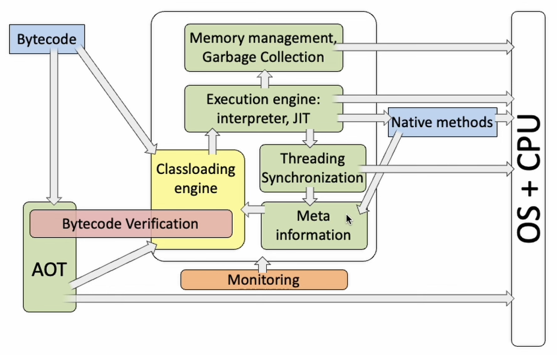
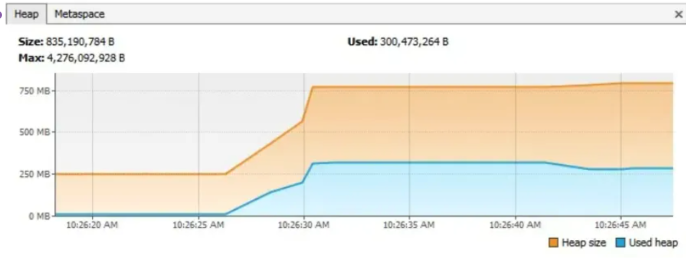

import Highlight from '@site/src/components/Highlight'
import Warn from '@site/src/components/Warn'
import Term from '@site/src/components/Term' 

# JVM

## JVM

#### 1. Describe JVM Memory Structure.
- JVM Architecture
    1. Class Loader: Loads, links, and initializes `.class` files
    2. Runtime Data Area: store data during execution
        - Method Area: metadata, static variables
        - Heap: object instances, shared across threads
        - Stack: per-thread, store frames (local variables, operand stack)
        - PC Register: per-thread, holds address of current instruction
        - Native Method Stack: for native methods (e.g. C/C++)
    3. Execution Engine: interprets or compiles bytecode


1. Program Counter
    1. What code and which line of code being executed is being held here.
    2. Considered as a line number indicator for the bytecode being executed by the current thread,
2. Stack
    1. Each thread has its own stack.
    2. Each stack has **frames**, each frame is created for each method call.
    3. Each method execution creates a stack frame to store the local variable table, operand stack, dynamic linking, method exit information.
    4. When method A calls method B, a new frame for method B is created. This new frame will then become the current frame, and also the top frame of the stack. The stack has access to this top frame only.
    5. Each frame is removed after method execution.
    6. Each frame consists of the following:
        1. Local variable array
            - For instance method, the first element is the reference to the object itself, i.e. this.
        2. Frame data
            - Consists of data needed to execute the method. Examples: reference to the constant pool.
        3. Operand stack
    7. StackOverFlowError is thrown if stack memory is too small for the frame
    8. OutOfMemoryError is thrown if not enough space for a new stack for a new thread

3. Heap
    1. The largest memory area in the JVM, shared by all threads.
    2. Used to store object instances.
    3. The heap is divided into the **young generation** and the **old generation**, with the young generation further split into the Eden area and two Survivor areas (From Survivor and To Survivor)
    4. `OutOfMemoryError` is thrown if not enough space for a new object instance.
4. Method Area (Metaspace)
    1. In JDK 1.8 and later versions, the method area has been replaced by metaspace.
    2. Used to store class information, constants, static variables, and other data loaded by the virtual machine.
5. Native Method Stack
    1. For native methods (e.g. C/C++)
6. Runtime Constant Pool

#### 2. What are the differences between the heap and stack in the JVM memory model?
    - Purpose
        - Stack: for local variables, method parameters, and method return addresses.
        - Heap: for object instances, arrays.
    - Lifecycle
        - Stack: created and destroyed with the method call.
        - Heap: indeterminate, objects are reclaimed by the GC only when they are no longer referenced.
    - Access Speed
        - Stack: fast, follows LIFO.
        - Heap: relatively slow, allocation and reclamation on the heap require more time. GC also impacts performance.
    - Storage Space
        - Stack: relatively small and fixed space.
        - Heap: has larger space that can dynamically expand.
    - Visibility
        - Stack: Data in stack is private to the thread.
        - Heap: Data in heap is shared across threads.

#### 3. What are the parts of the heap?
    - <Term>Young Generation</Term>
        1. Divided into `Eden Space` and `Survivor Space`
        2. Most newly created objects are initially store in Eden Space.
        3. When Eden Space is full, a **Minor GC** is triggered.
        4. Survivor Spaces are usually divided into two equal-sized areas called **S0 (Survivor 0)** and **S1 (Survivor 1)**.
        5. Objects that have survived multiple minor GCs are moved to the Survivor Space.
    - <Term>Old Generation</Term>
        1. Objects that survive one or more Minor GCs are moved to the old generation.
        2. Objects in the old generation have longer lifecycles, so Major GC (also known as Full GC, which involves old generation garbage collection) occurs less frequently but typically takes longer to execute than Minor GC.
        3. Usually has more space than the young generation to accommodate a larger number of long-lived objects.
    - <Term>Metaspace</Term>
        1. Starting with Java 8, the Permanent Generation was replaced by the metaspace.
        2. Used to store class metadata information, such as class structure details (e.g., field and method information).
        3. Is not part of the Java heap but uses native (local) memory
    - <Term>Large Object Space/Humongous Objects</Term>
        1. In some JVM implementations (e.g., the G1 garbage collector), a dedicated area called the Large Object Space or Humongous Objects region is allocated for large objects.
        2. Large objects are those requiring a significant amount of contiguous memory space, such as large arrays.
        3. These objects are directly allocated in the old generation to avoid memory fragmentation caused by frequent promotions from the young generation.

#### 4. Where is a String stored?
- A `String` is stored in the **string constant pool**, unlike other objects. Its value is immutable and can be **shared by multiple references**.

#### 5. Which memory regions are involved when String s = new String("abc") is executed?
- The execution process of String s = new String("abc") involves the following memory regions:
    1. Heap Memory
        - First, we notice the `new` keyword in the code. We know that the new instruction creates an instance of a class and completes its initialization. Since this string object is **determined at runtime**, the created string object is allocated in the heap memory.
    2. String Constant Pool
        - Next, within the String constructor, a string literal "abc" is passed. Since "abc" is a final-modified attribute here, it is considered a string constant.
        - When this object is first constructed, the JVM takes the literal `"abc"` and attempts to retrieve the corresponding `String` object reference from the string constant pool.
        - If the reference does not exist, a `String` object for `"abc"` is created in the heap, and its **reference is saved in the string constant pool**, which is then returned.
- Summary
    1. If the string constant `"abc"` does not exist in the pool, two objects are created: the string constant "abc" and the instance object created by new String.
    2. If the string constant "abc" already exists in the pool, only one object is created (the instance from new String), as the constant pool reuses the existing reference.

#### 6. What are the types of references, and what are their differences?
- Reference types in Java are primarily categorized into four types: strong, soft, weak, and phantom references.
    - <Term>Strong Reference</Term>: This is the most common assignment method in code, such as A a = new A(). Objects associated with strong references will never be garbage collected (GC) by the system.
    - <Term>Soft Reference</Term>: Described using `SoftReference`, soft references refer to useful but non-essential objects. The system will reclaim objects referenced by soft references before an OutOfMemoryError occurs.
    - <Term>Weak Reference</Term>: Described using `WeakReference`, weak references are slightly weaker than soft references. Objects referenced by weak references will be reclaimed during the next GC cycle, regardless of whether memory is sufficient.
    - <Term>Phantom Reference</Term>: Also known as a phantom reference, it is the weakest type of reference relationship and can be described using `PhantomReference`. It must be used with a `ReferenceQueue`.

#### 7. Do you understand weak references? Provide examples of where they can be used?
- In Java, a weak reference is a type of reference that does not prevent an object from being garbage collected.
-  Weak references are implemented in Java using the java.lang.ref.WeakReference class. A primary use of weak references is to create non-mandatory object references that can be cleaned up by the garbage collector under memory pressure, thereby avoiding memory leaks.

- Usage Scenarios for Weak References:
    1. Cache System: Weak references are commonly used to implement caches, especially when it is desirable for cache items to be automatically released under memory pressure. If the cache size is uncontrolled, it could lead to memory overflow. Using weak references to maintain the cache allows the JVM to automatically clear these cache objects when more memory is needed.
    2. Object Pool: In an object pool, weak references can be used to manage objects that are temporarily unused. When these objects are no longer strongly referenced, they can be garbage collected, freeing up memory.
    3. Avoiding Memory Leaks: When an object should not be retained for a long time, using a weak reference can prevent it from being accidentally held, thus avoiding potential memory leaks.


- Example
    ```java
    import Java.lang.ref.WeakReference;
    import Java.util.HashMap;
    import Java.util.Map;

    public class CacheExample {

        private Map<String, WeakReference<MyHeavyObject>> cache = new HashMap<>();

        public MyHeavyObject get(String key) {
            WeakReference<MyHeavyObject> ref = cache.get(key);
            if (ref != null) {
                return ref.get();
            } else {
                MyHeavyObject obj = new MyHeavyObject();
                cache.put(key, new WeakReference<>(obj));
                return obj;
            }
        }

        // 假设MyHeavyObject是一个占用大量内存的对象
        private static class MyHeavyObject {
            private byte[] largeData = new byte[1024 * 1024 * 10]; // 10MB data
        }
    }
    ```
#### 8. Tell me your understanding of Memory Leaks and Memory Overflows.
1. Memory Leaks:
    1. Occurs when objects that are no longer used during program execution are still being referenced and thus cannot be reclaimed by the garbage collector.
    2. Common Causes of Memory Leaks:
        - Static Collections: Using **static data structures** (e.g., HashMap or ArrayList) to store objects without clearing them.
        - Event Listeners: Failing to unregister listeners from event sources, causing objects to remain referenced.
        - Threads: Unterminated threads that may hold object references, preventing reclamation.

2. Memory Overflows:
    1. Occurs when the Java Virtual Machine (JVM) cannot allocate sufficient memory when requested, ultimately triggering an `OutOfMemoryError`.
    2. Common Causes of Memory Overflow:
        - Massive Object Creation: Continuously creating a large number of objects that exceed the JVM heap limit.
        - Persistent References: Large data structures (e.g., caches, collections) holding object references for extended periods, leading to memory accumulation.
        - Recursive Calls: Deep recursion causing stack overflow.

#### 9. Example of Memory Leak and Memory Leak? How to detect and fix it?
##### Example 1. Caused by Static Properties
- Code Example
    ```java
        import java.util.ArrayList;
        import java.util.List;

        public class StaticTest {
            public static List<Double> list = new ArrayList<>();
            public void populateList() {
                for (int i = 0; i < 10000000; i++) {
                    list.add(Math.random());
                }
                System.out.println("Debug Point 2");
            }

            public static void main(String[] args) {
                System.out.println("Debug Point 1");
                new StaticTest().populateList();
                System.out.println("Debug Point 3");
            }
        }
    ```
- Problem Description
    - `static List<Double> list` is a static variable, meaning its lifecycle persists throughout the application's runtime.
    - After the method executes, the list remains in memory because it is statically referenced, preventing the garbage collector from reclaiming the memory, even though the list is no longer needed after the method call.
- Observation
    
- Solution
    - Change `public static List<Double>` list to `public List<Double> list`
- Result
    - With VisualVM, you’ll notice the heap memory increases during populateList but is reclaimed after the instance is set to null and the GC runs.
- Take-away
    - If collections or a large number of objects are defined as static, they will persist throughout the entire application lifecycle.
- How to Optimize?
    1. Reduce the Use of Static Variables: Minimize the declaration of static variables to avoid unnecessary retention of objects in memory.
    2. Use **Lazy Loading with Singletons**: If a singleton is required, implement lazy loading to defer object creation until it is actually needed, reducing memory usage during the application's startup phase.
        ```java
        private static LazySingleton instance;

        private LazySingleton() {
            System.out.println("Singleton instance being created...");
        }

        public static synchronized LazySingleton getInstance() {
            if (instance == null) {
                instance = new LazySingleton();
            }
            return instance;
        }

        public static void main(String[] args) {
            System.out.println("Before getting instance");

            LazySingleton singleton1 = LazySingleton.getInstance();
            LazySingleton singleton2 = LazySingleton.getInstance();

            System.out.println("singleton1 == singleton2: " + (singleton1 == singleton2)); // Output: true
        }
        ```

##### Example 2. Caused by Unclosed Resources
- Problem Description
    1. Whenever we create a connection or open a stream, the JVM allocates memory for these resources, such as database connections, input streams, and session objects.
    2. Forgetting to close these resources can block memory, preventing the garbage collector (GC) from cleaning them up.
    3. This issue is particularly severe when an exception occurs and resources are not closed in a `finally` block.

- Code Eaxmple
    ```java
    public class UnclosedResourceExample {
        public static void main(String[] args) {
            Connection conn = null;
            try {
                // Establish a database connection
                conn = DriverManager.getConnection("jdbc:mysql://localhost:3306/test", "user", "password");
                System.out.println("Connection established");
                // Simulate some work
                Thread.sleep(2000);
            } catch (SQLException | InterruptedException e) {
                e.printStackTrace();
            }
            // Connection is not closed, leading to a memory leak
            System.out.println("Program ended");
        }
    }
    ```

- Solution
    1. Always Close Resources in `finally` Block
    2. Ensure Closing Code Does Not Throw Exceptions.
        - Wrap the closing logic to handle any exceptions sliently.
        - Log them without interrupting program flow.
    3. The `try-with-resources` statement

## Garbage Collection
#### 1. What is Garbage?
- Objects that are unreachable by the program, there is no way for the program to access them through any chain of references.

#### 2. What is Not Garbage \(Live Object\)?
- The objects that are still accessible by the program.
1. Objects in staic fields of classes
    - Stored in class's static memory and remain accessible as long as the class is loaded
    - Example: `static Object myStaticObj = new Object();`
2. Objects in local variable accessible from method frames
    - Objects that referenced by local variables or operands in the stack frames of any active thread.
3. Objects referenced by other live objects

#### 3. What is GC Roots?
- The starting points used by the GC to determine which objects are live.
- Any object reachable from a GC root is considered live and not garbage.
- Includes:
    1. Objects in static fields of classes
    2. Objects accessible from thread stacks
    3. Objects referenced by JNI \(Jave Native Interface\) references in native methods.  

#### 4. What is Stop-the-World?
1. To collect the garbage, all threads should be paused to determine garbage.
2. One of the main tasks of modern garbage collector are to reduce the STW pause.
3. Method to reduce the STW:
    1. Incremental:
        - Do not collect all the garbage within GC pause.
    2. Parallel:
        - Collect the garbage in parallel threads within GC pause.
    3. Concurrent:
        - Collect the garbage concurrently with program execution.

#### 5. What is Garbage Collection in Java, and How is it Triggered?
- <Term>Garbage Collection</Term>
    - It is responsible for freeing up memory occupied by objects that are no longer referenced by the program. 
- Can be triggered in several ways:
    1. When Memory is Insufficient
        - JVM automatically triggers garbage collection when it detects that the heap memory is insufficient to allocate space for new objects.
    2. Manual Request
        - By calling `System.gc()` or `Runtime.getRuntime().gc()`.
    3. JVM Parameters
        - JVM parameters: `-Xmx` (maximum heap size) and `-Xms` (initial heap size).
    4. Object Count or Memory Usage Reaching a Threshold
        - Garbage collectors implement internal strategies to monitor object creation and memory usage, triggering garbage collection when a certain threshold is reached.

#### 6. What is the garbage collection algorithm, and what problem does it solve?
- In traditional programming languages, developers are required to manually allocate and release memory, which can lead to problems such as memory leaks and memory overflows.
- Java provide a simpler and safer programming environment, which is why it uses a garbage collector to automatically manage memory.
- Main Goals:
    1. Automatically detect and reclaim memory occupied by objects that are no longer in use.
    2. Prevent Memory Leak. Where memory is allocated to objects that cannot be freed, resulting in wasted memory resources.
    3. Prevent Memory Overflow. Where the program requires more memory than is available.

#### 7. Differences Between Minor GC, Major GC, and Full GC, and Scenarios Triggering Full GC
- GC can be categorized into three types: Minor GC (also known as Young GC), Major GC (sometimes referred to as Old GC), and Full GC.

- <Term>Minor GC (Young GC)</Term>
    - Scope: Targets only the young generation, including the Eden area and the two Survivor areas (S0 and S1).
    - Trigger Condition: JVM triggers a Minor GC when the Eden space is insufficient, moving surviving objects from the Eden area and one Survivor area to the other Survivor area or the old generation (Old Generation).
    - Characteristics: Occurs frequently because objects in the young generation typically have short lifecycles, with high recycling efficiency and relatively short pause times.
- <Term>Major GC</Term>
    - Scope: Primarily targets the old generation for recycling, though it does not necessarily limit itself to the old generation.
    - Trigger Condition: 
        1. Triggered when the old generation space is insufficient
        2. When the system detects that objects are being promoted from the young generation to the old generation at a rapid rate.
    - Characteristics: Occurs less frequently than Minor GC, but each collection may take longer because objects in the old generation have a higher survival rate.
- <Term>Full GC</Term>
    - Scope: Performs a collection across the entire heap memory, including the young generation, old generation, and permanent generation/metaspace.
    - Trigger Conditions:
        1. When System.gc() or Runtime.getRuntime().gc() is called directly, although it does not guarantee immediate execution, the JVM will attempt to perform a Full GC.
        2. During a Minor GC (young generation garbage collection), if surviving objects cannot all be accommodated in the old generation, or if the old generation lacks sufficient space for the surviving objects, a Full GC is triggered to reclaim the entire heap.
        3. When the permanent generation (in versions before Java 8) or metaspace (in Java 8 and later) runs out of space.
    - Characteristics: Full GC is the most resource-intensive operation, as it requires stopping all working threads (Stop The World) to traverse the entire heap and reclaim unused objects. Therefore, efforts should be made to minimize Full GC triggers.