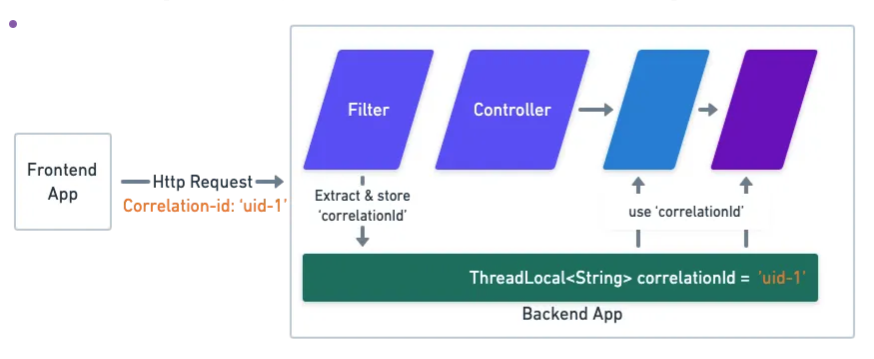
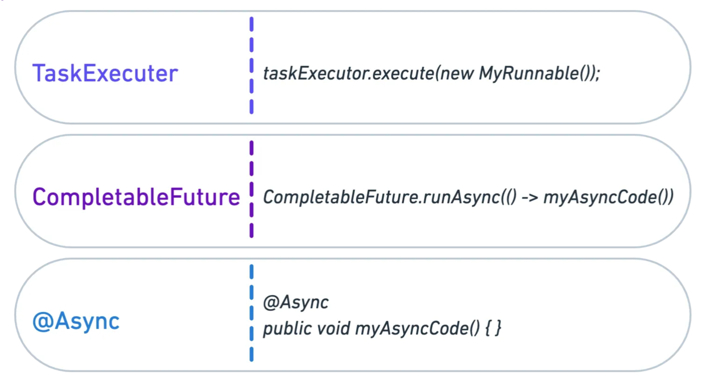
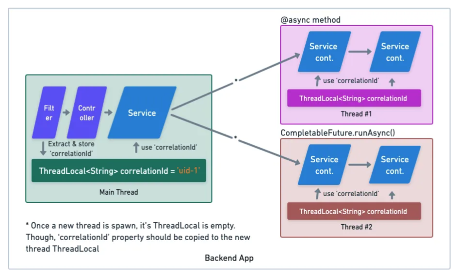

# Multi-threading in Spring

### Thread Creation
1. Spring use `org.springframework.core.task.TaskExecutor` to create and manage threads.
2. Use `ThreadLocal` for thread-specific data to avoid shared state conflicts.

```java 
@Bean(name = "apiTaskExecutor")
public TaskExecutor taskExecutor() {
    ThreadPoolTaskExecutor executor = new ThreadPoolTaskExecutor();
    executor.setCorePoolSize(8); // Base number of threads
    executor.setMaxPoolSize(16); // Maximum threads allowed
    executor.setQueueCapacity(100); // Task queue size
    executor.setThreadNamePrefix("AsyncThread-");
    executor.setRejectedExecutionHandler(new ThreadPoolExecutor.CallerRunsPolicy());
    executor.setTaskDecorator(runnable -> {
        String userId = userContext.get();
        return () -> {
            try {
                userContext.set(userId);
                runnable.run();
            } finally {
                userContext.remove();
            }
        };
    });
    executor.initialize();
    return executor;
}

private final ThreadLocal<String> userContext = new ThreadLocal<>();
userContext.set(userId);
userContext.get();
userContext.remove();
```

### Thread Management
1. Create distinct thread pools for different types of tasks.
    - One pool for database operations, another for external API calls.
2. Use `CompletableFuture` for asynchronous tasks.
    ```java
    @Autowired
    @Qualifier("apiTaskExecutor")
    private TaskExecutor apiTaskExecutor;

    public CompletableFuture<String> fetchDataAsync(String url) {
        return CompletableFuture.supplyAsync(() -> {
            // Simulate external API call
            return callExternalApi(url);
        }, apiTaskExecutor);
    }
    ```

### Asynchronous Tasks
1. Asynchronous processing is ideal for long-running or I/O-bound tasks (e.g. calling external APIs)
2. Use `@Transactional` in async methods for database operations.
    ```java
    @Async("dbTaskExecutor")
    @Transactional
    public CompletableFuture<Void> saveDataAsync(Data data) {
        dataRepository.save(data);
        return CompletableFuture.completedFuture(null);
    }
    ```

### Locking
1. Use `synchronized` or `ReentrantLock`.
    ```java
    public synchronized void updateSharedResource() {
        // Critical section
    }

    private final ReentrantLock lock = new ReentrantLock();

    public void updateResource() {
        lock.lock();
        try {
            // Critical section
        } finally {
            lock.unlock();
        }
    }
    ```
2. Use `ConcurrentHashMap`, `CopyOnWriteArrayList`, or `BlockingQueue` for simple shared stage.
3. Use optimistic locking with `@Version` in JPA.
    ```java
    @Entity
    public class Product {
        @Id
        private Long id;
        @Version
        private Long version;
        // Other fields
    }
    ```

4. Use pessimistic locking with `LockModeType`.
    ```java
    @Query("SELECT p FROM Product p WHERE p.id = :id")
    @Lock(LockModeType.PESSIMISTIC_WRITE)
    Product lockProduct(@Param("id") Long id);
    ```
5. Use Redis to implement distributed locks with `INCR`, `EXPIRE`, and `DEL`

## Thread Local
- When a thread terminates, its `ThreadLocalMap` is also destroyed. However, the `ThreadLocal` object itself is not immediately garbage collected until there are no other references to it.
- Therefore, when using `ThreadLocal`, you need to be cautious. If the `remove()` method is not explicitly called, or if the `ThreadLocal` variables are not properly cleaned up when the thread ends, it may lead to memory leaks. This is because the `ThreadLocalMap` will continue to hold references to the `ThreadLocal` variables, even if they are no longer referenced elsewhere.

## TaskDecorator
### The 'correlation-id' Challenge




- A TaskDecorator is simply a Callable interface you can implement and enhance your Executor with.
- We can copy of the correlation-id from the parent thread
- In this way, any thread that is executed by our executor will be supplied with the parent correlation-id property.
- https://medium.com/att-israel/dont-lose-your-thread-manage-and-decorate-your-concurrent-threads-391cf34e6bc6.