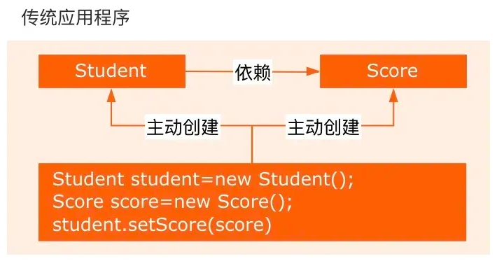
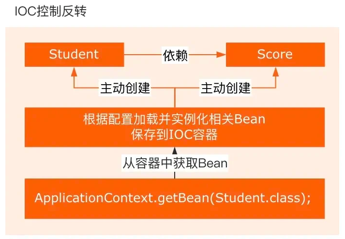
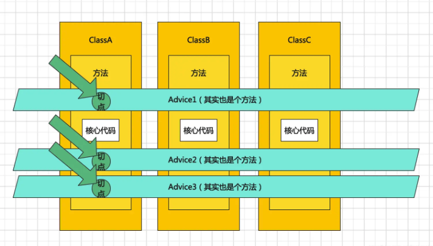

import Highlight from '@site/src/components/Highlight'
import Warn from '@site/src/components/Warn'
import Term from '@site/src/components/Term'

# Spring

#### 1. Tell me about your understanding of Spring
- Core features of the Spring framework:
1. <Term>Inversion of Control (IoC)</Term>
    1. To manage the creation of objects and their dependencies.
    2. Developer only need to define the Beans and their dependencies, while the Spring container handles the creation and assembly of these objects.
2. <Term>Aspect-Oriented Programming (AOP)</Term>
    1. Allow developers to define cross-cutting concerns such as logging, security, and performance monitoring.
    2. These concerns can be modularized and reused across multiple components, improving code maintainability and reusability.
3. <Term>Transaction Management</Term>
    1. Spring provides a consistent transaction management interface, supporting both declarative and programmatic transaction management.
    2. Developers can easily manage transactions without needing to deal with specific transaction APIs.
4. <Term>MVC Framework</Term>
    1. Spring MVC is a web framework built on the Servlet API, adopting the Model-View-Controller (MVC) design pattern.

#### 2. Discuss your understanding of the core ideas of Spring?
| Core Idea       | Issues Addressed                                | Implementation Means             | Typical Application Scenarios     |
|-----------------|------------------------------------------------|-----------------------------------|------------------------------------|
| **IoC**         | High coupling in object creation and dependency management | Container-managed Bean lifecycle  | Dynamic replacement of database implementations, server groups |
| **DI**          | Hard-coded dependency issues                    | Setter/Constructor injection/Annotation     | Injection of data sources, service layer relies on DAO layer |
| **AOP**         | Cross-cutting logic scattered in business code  | Dynamic proxy and aspect configuration | Logging, transactions, unified permission validation |

#### 3. Introduce Spring IoC.
1. IoC, a design principle.

    - In traditional Java SE programming, we directly create objects within a class using the `new` keyword, meaning the program actively create dependent objects.
        

    - In Spring, however, IoC involves a dedicated container to manage the lifecycle of objects.
        
2. The term "control" refers to the creation, initialization, and destruction of objects.
    1. Creating objects: Previously done with `new`, it is now handled by the Spring container.
    2. Initializing objects: Previously, objects were initialized by assigning dependent objects through constructors or setter methods; now, the Spring container automatically injects them.
    3. Destroying objects: Previously, this involved manually setting objects to null or performing cleanup operations; now, the Spring container manages the lifecycle and handles object destruction.
3. IoC simplifies the cumbersome management of object lifecycles and decouples our code.
4. The so-called "inversion" refers to the reversal of control. As mentioned earlier, the Spring container now controls the object lifecycle, meaning the control of objects is entirely removed from our hands and handed over to Spring.

#### 4. Introduce Spring AOP.
##### Why need AOP?
1. Used to separate cross-cutting logic from business logic.
    - In the concept of AOP, functionalities are divided into two types:
        1. Business logic: Authentication, CRUD, etc.
        2. Peripheral logic: Logging, Transaction, etc.
    - Core business functionalities and peripheral functionalities **are developed independently**, with no coupling between them.
    - These aspect functionalities are then "woven" together with the core business functionalities, which is what defines AOP.
    - AOP can encapsulate logic or responsibilities (such as transaction handling, logging, and permission control) that are unrelated to the core business logic.
    - Helps reduce redundant code in the system, lower coupling between modules, and improve modularity and maintainability.

2. Supplement to Object-Oriented Programming
    1. AOP as a **compensation for the lack of support for multiple inheritance** in OOP.
    2. Apart from the primary characteristics of an object being abstracted into an inheritance chain, for some secondary characteristics, AOP can be used to implement them.
    3. Such as print log. The need to print logs may be common among many objects. However, log printing does not reflect the primary characteristics of an object. Moreover, log printing is a specific task that **cannot be abstracted**, so it **cannot be accomplished through interfaces**. If inheritance were used, the task of log printing would be implemented in the child class, which is not ideal. As it would disrupt the distinction of these strong commonalities.
    4. AOP first defines some Advice (enhancements) within an Aspect (aspect), which includes the specific implemented code, while also organizing the join points.
    

##### AOP Concept
1. <Term>AspectJ</Term>
    1. An aspect, which is purely a conceptual term without specific interface or class association.
    2. A collective term for Join Point, Advice, and Pointcut.
2. <Term>Join Point</Term>
    1. A connection point, referring to a specific point in the program's execution, such as method calls or exception handling.
    2. In Spring AOP, only **method-level join points** are supported.
3. <Term>Advice</Term>
    1. Notification, which is the cross-cutting logic defined within an aspect.
    2. Come in three types: "around", "before", and "after". 
    3. In many AOP implementation frameworks, Advice typically acts as an interceptor and can include multiple interceptors forming a chain around a Join Point for processing.
4. <Term>Pointcut</Term>
    1. Used to match Join Points.
    2. In AspectJ, which join points are included in an aspect is determined by the Pointcut through filtering.    
5. <Term>Introduction</Term>
    1. Allows an aspect to declare that the advised object implements additional interfaces that it does not actually implement.
    2. For example, it can enable a proxy object to proxy two target classes.
6. <Term>Weaving</Term>
    1. Weaving, which involves applying join points, pointcuts, advice, and aspects to a program.
    2. This is achieved by inserting the advice logic into the target method under the guidance of the pointcut, ensuring the advice logic executes during method calls.
7. <Term>AOP Proxy</Term>
    1. Referring to the object that implements the aspect protocol in an AOP framework.
    2. In Spring AOP, there are two types of AOP proxies: JDK dynamic proxy and CGLIB proxy.
8. <Term>Target</Term>
    1. The target object, which is the object being proxied.

#### 5. Do you understand the principles of Spring AOP?
1. Relies on dynamic proxy.
2. Dynamic proxy generate proxy objects at runtime rather than compile time.
3. Enable the enhancement of method functionality without modifying the original code.

- Spring APO supports two types of dynamic proxies:
    1. JDK-based dynamic proxy: Implemented using `java.lang.reflect.Proxy` class and `java.lang.reflect.InvocationHandler` interface.
    2. CGLIB-based dynamic proxy: When the proxied class does not implement an interface, Spring uses the CGLIB library to generate a subclass of the proxied class as the proxy. CGLIB (Code Generation Library) is a third-party code generation library that implements proxying through inheritance.

#### 6. What mechanisms are used to implement IoC and AOP?

#### 7. What are the differences between dynamic proxy and static proxy?
1. To provide a proxy for other object to control access to a specific object, thereby decoupling the relationship between two classes.
2. Both the proxy class and the delegates class must implement the same interface, as the proxy calls the methods of the delegate class.

- Differences:
1. <Term>Static Proxy</Term>
    1. Created by programmer, the proxied class is determined at compile time.
    2. Typically proxy only one class.
2. <Term>Dynamic Proxy</Term>
    1. Generated at runtime using reflection mechanism.
    2. Can proxy multiple classes under an interface.