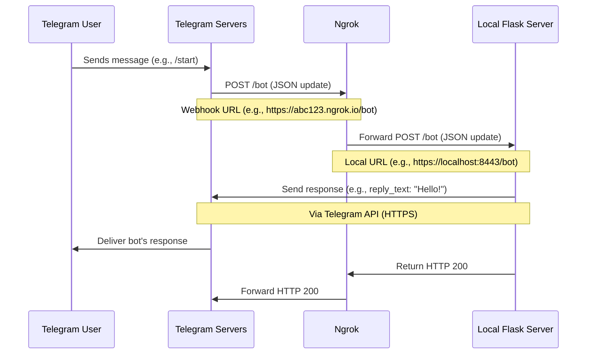

# AI Assitant

## I. Dependency
### Redis
- redis-stack-server
```bash
brew tap redis-stack/redis-stack
brew install redis-stack
# start the server
redis-stack-server
```

### Python
- Homebrew is a system-level package manager for macOS
- pip3 is package manager to install libraries into Python3 environment(global/virtual)

```bash
brew install python@3.13
brew install poetry

pip3 --version
# pip 25.0 from /opt/homebrew/lib/python3.13/site-packages/pip (python 3.13)

python3 -m pip --version
# pip 25.0 from /opt/homebrew/lib/python3.13/site-packages/pip (python 3.13)

which pip3
# /opt/homebrew/bin/pip3
```

### Poetry
```bash
brew install poetry

# use poetry to create new project
poetry new my-new-project

# 1. create .toml file for pre-populated project
poetry init
# 2. To install the defined dependencies, run:
poetry install

eval $(poetry env activate)
poetry env remove --all

# for cloned repo
poetry init
# poetry add $(cat requirements.txt)
poetry install
source $(poetry env info --path)/bin/activate
poetry show --tree

# add dependency
poetry add python-telegram-bot
poetry add "flask[async]"

➜  ai-assitant-schedule poetry env list
ai-assitant-0MNpsWbR-py3.13 (Activated)
➜  ai-assitant-schedule poetry env remove ai-assitant-0MNpsWbR-py3.13
Deleted virtualenv: /Users/hoimingkenny/Library/Caches/pypoetry/virtualenvs/ai-assitant-0MNpsWbR-py3.13

# run the application
poetry run python -m src.botwebhook
```

### Ngrok
- For testing webhooks on local

```bash
# instllation
brew install ngrok
ngrok config add-authtoken 2wf..

# run ngrok to get the public URL
ngrok http 8443 # Forwarding: https://2815-223-18-156-235.ngrok-free.app -> http://localhost:8443

# testing connectivity
curl -k https://localhost:8443/health
curl https://2815-223-18-156-235.ngrok-free.app/health
```


## II. Project
Entrance Python file: botwebhook.py

### Sequence Diagram(Test webhook on local)


## III. New Knowledge
### Python
```python
def main():
    print("This runs when the script is executed directly.")

if __name__ == '__main__':
    main()
```
- If you run this script directly (e.g., python script.py), it prints: This runs when the script is executed directly.
- If you import this script as a module in another script (e.g., import script), the main() function won’t execute automatically because `__name__` will be 'script', not `__main__`

### Telegram Bot
#### Polling
- It involves *repeatedly making requests* to the Telegram Bot API to check for new updates

#### Webhook
- Setting up a server to receive updates from Telegram Bot API
- Telegram sends updates directly to the server whenever a new event occurs(push updates to you)


