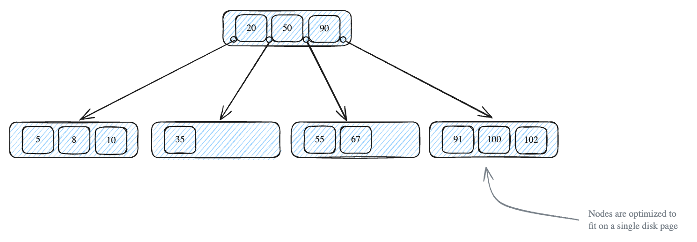
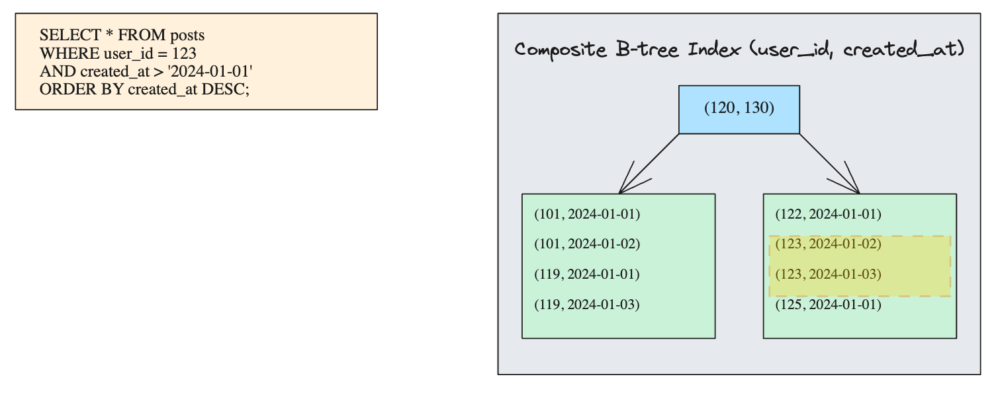

# Database Indexing

## How Database Indexes Work
### Physical Storage and Access Pattern
- Data lives on disk (typically SSDs nowadays), we can only process it when it's in memory.

### The Cost of Indexing
- Every index we create requires additional disk space.
- When we insert a new row or update an existing row, we need to update the index.
- With multiple indexes, we need to update all indexes.
- Some classic case:
    1. Logging table
        - Frequent writes but infrequent reads
        - We constantly inserting new records but rarely querying old ones.
    2. Small tables with just few hundred rows
        - The cost of maintaining an index and traversing its structure might exceed the cost of a simple sequential scan.

## Pros and Cons of Indexing
### Pros: Improve Query Performance
    - If a query does not use an index, it will result in a full table scan, with a time complexity of `O(n)`.
    - However, if an index is used, the query can levearge a binary search algorithm to quickly locate the target data. 
    - The time complexity is `O(log_d n)`, where d is the maximum number of childs allowed for a node.
### Cons:
    1. Indexes require physical storage space, and the more indexes there are, the more space they consume.
    2. Creating and maintaining indexes takes time, and this time increases as the data volume grows.
    3. Indexes slow down insert, delete, and update operations on the table. This is because the B-tree, used by the index, must be **dynamically rotated to preserve its ordered** structure each time the data is modified.


## Index Types
### B-Tree Indexes
- Fast searches and updates.
- Acheived by maintaining a balanced tree structure that minimizes the number of disk reads required to find a record.

#### Structure of B-Trees
- A B-Tree is a self-balancing tree that maintain sorted data and allows for efficient insertions, deletions, and searches.
- B-tree nodes can have multiple children - typlically hundreds in practice.
- Each node contains an ordered array of keys and pointes.


- Every node in a B-tree follows strict rules:
    - All leaf nodes must be at the same level (depth).
    - A node with k keys must have exactly k+1 children.
    - Keys within a node are kept in sorted order.

- This structure maps perfectly to how databases store data on disk.
- Each node is sized to fit in a single disk page (typically 8KB), maximizing our I/O efficiency.

#### Real-World Example
- PostgreSQL uses B-trees for primary keys, unique constraints, and most regular indexes.

```sql
CREATE TABLE users (
    id SERIAL PRIMARY KEY,
    email VARCHAR(255) UNIQUE
);
```

#### Why B-Trees Are the Default Choice
1. **Mintain sorted order**, making range queries and ORDER BY operations efficient.
2. **Self-balancing**, ensuring predictable performance even as data grows.
3. **Minimize disk I/O** by matching their structure to how databases store data.
4. Handle both equality searches (email = 'x') and range searches (age > 25) equally well.
5. Remain balanced even with random inserts and deletes, avoiding the performance cliffs you might see with simpler tree structures.

### Inverted Indexes
- B-tree excels at finding exact matches and ranges, they fall short when we need to search through text content.

- Why Index using B-tree not works?
    ```sql
    SELECT * FROM posts WHERE content LIKE '%database%';
    ```
    - Even with a B-tree index on the content column, the database can't use the index at all.
    - B-tree indexes can **only help with prefix matches (like 'database%')** or suffix matches (if you index the reversed content).
    - When the pattern could match anywhere within the text, the database has no choice but to check every row.

- How Inverted Indexes works?
    - Think of it like the index at the back of a textbook.
    ```sql
    doc1: "B-trees are fast and reliable"
    doc2: "Hash tables are fast but limited"
    doc3: "B-trees handle range queries well"

    -- create a mapping of 
    b-trees  -> [doc1, doc3]
    fast     -> [doc1, doc2]
    reliable -> [doc1]
    hash     -> [doc2]
    tables   -> [doc2]
    limited  -> [doc2]
    handle   -> [doc3]
    range    -> [doc3]
    queries  -> [doc3]
    ```

- Trade-offs:
    - When a document changes, we need to update entries for every term it contains.


## Index Optimization Patterns
### Composite Indexes
- Instead of creating separate indexes for each column, we create a single index that combines multiple columns in a specific order.

- Consider we create two separate indexes:  
    ```sql
    SELECT * FROM posts 
    WHERE user_id = 123 
    AND created_at > '2024-01-01'
    ORDER BY created_at DESC;

    CREATE INDEX idx_user ON posts(user_id);
    CREATE INDEX idx_time ON posts(created_at);
    ```
    - But this isn't efficient. The database needs to:
        1. Use one index to find all the posts for user 123.
        2. Use another index to find all posits after 2024-01-01.
        3. Intersect these results.
        4. Sort the final results set by `created_at`.

- When we use composite index,
    ```sql
    CREATE INDEX idx_user_time ON posts(user_id, created_at);
    ```
    
    - Each node's key in the B-tree is actually a tuple of the indexed columns.
    - The keys are in sorted order based on `user_id`, then `created_at`.
        ```sql title="Conceptual Ordering of Keys"
        (1, 2024-01-01)
        (1, 2024-01-02)
        (1, 2024-01-03)
        (2, 2024-01-01)
        (2, 2024-01-02)
        (3, 2024-01-01)
        ```
    - When we execute our query, the database can traverse the B-tree to find the first entry for `user_id=123`, then scan sequentially through the index entries for that user.
    - Both filtering and sorting in the query are **handled by a single index scan**.

#### The Order Matters
- Fields placed earlier in the index are more likely to be used for filtering.
- Fields with **high selectivity (or high cardinality)** should be placed first, as they are more likely to be used by a wider range of SQL queries.
- For example:
    - A field like gender has low selectivity (e.g., only two values: male and female), making it unsuitable for indexing or for being placed early in a composite index.
    - A field like UUID has high selectivity, making it ideal for indexing or being placed early in a composite index.

- If an index has low selectivity and the values are evenly distributed, querying any value might return a large portion of the data (e.g., half the table).
### Covering Indexes
- An index that contains all the columns required by a query, allowing the query to be completed without accessing the table's data rows.
- All the data needed for the query can be retrieved directly from the index.
- Improves query performance by reducing the number of data page accesses, thereby decreasing I/O operations.

```sql
CREATE TABLE employees (
  id INT PRIMARY KEY,
  name VARCHAR(100),
  age INT,
  department VARCHAR(100),
  salary DECIMAL(10, 2)
);

CREATE INDEX idx_name_age_department ON employees(name, age, department);

SELECT name, age, department FROM employees WHERE name = 'John';
```

## Situations Where Indexes Become Invalid
1. `LIKE %xx` or `LIKE %xx%` in LIKE Queries
- The index becomes invalid because the query cannot utilize the sorted structure of the index effectively.

2. Using Functions on Indexed Columns in Query Conditions
```sql
SELECT * FROM users WHERE UPPER(username) = 'ALICE';
```

3. Performing Expression Calculations on Indexed Columns
- If an indexed column is used in an expression (e.g., `WHERE indexed_column + 1 = 5`).

4. Implicit Type Conversion Due to String-to-Number Comparison
- If the indexed column is a string and the query condition uses a numeric value (e.g., `WHERE indexed_string_column = 123`), an implicit type conversion occurs.

5. Violating the Leftmost Matching Principle in Composite Indexes
- For composite indexes, queries must adhere to the leftmost matching principle, meaning the query must match the index fields in their defined order (left to right).

6. Using OR with Mixed Indexed and Non-Indexed Columns
- In a `WHERE` clause, if the condition before an `OR` operator uses an indexed column but the condition after `OR` uses a non-indexed column, the index becomes invalid.