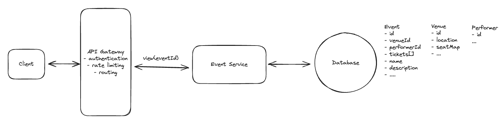

# Ticket Master

## Requirements
### Functional Requirements
#### Core Requirement
1. Users should be able to view events.
2. Users should be able to search for events.
3. Users should be able to book tickets to events.

#### Below the line (out of scope)
1. Users should be able to view their booked events.
2. Admins or event coordinators should be able to add events.
3. Popular events should have dynamic pricing.

### Non-Functional Requirements
#### Core Requirements
1. The system should prioritize availability for searching & viewing events, but should prioritize consistency for booking events (no double booking).
2. The system should be scalable and able to handle high throughput in the form of popular events (10 million users, one event).
3. The system should have low latency search (< 500ms)
4. The system is read heavy, and thus needs to be able to support high read throughput (100:1).

#### Below the line (out of scope)
1. The system should protect user data and adhere to GDPR.
2. The system should be fault tolerant.
3. The system should provide secure transactions for purchases.
4. The system should be well tested and easy to deploy (CI/CD pipelines).
5. The system should have regular backups.

## The Set Up
### Defining the Core Entities
1. Event: Date, description, location, etc.
2. User: User ID, etc.
3. Performer: Name, bio, etc.
4. Venue: Address, capacity, specific seat map, etc.
5. Ticket: Associated event ID, seat details, pricing and status (available or sold).
6. Booking: 
    - Records the details of a user's ticket purchase. Include user ID, ticket ID, booking date, etc.
    - Key in managing the transaction aspect of the ticket purchasing process.

### API or System Interface
1. View events:
```java
GET /events/{eventId} -> Event & Venue & Ticket[]
```
2. Search events:
```java
GET /events/search?keyword={keyword}&start={start_date}&end={end_date}&pageSize={page_size}&page={page_number} -> Event[]
```
3. Book tickets:
```java
POST /bookings/{eventId} -> bookingId
 {
   "ticketIds": string[], 
   "paymentDetails": ...
 }
```

## High-Level Design
1. Users should be able to view events
    
    1. The client makes a REST GET request with the eventId.
    2. The API gateway then forwards the request onto our Event Service.
    3. The Event Service then queries the Events DB for the event, venue, and performer information and returns it to the client.

2. Users should be able to search events
    1. The client makes a REST GET request with the search parameters.
    2. Our load balancer accepts the request and routes it to the API gateway with the fewest current connections.
    3. The API gateway then, after handling basic authentication and rate limiting, forward the request onto our Search Service.
    4. The Search Service then queries the Events DB for the events matching the search parameters and returns them to the client.

3. Users should be able to book tickets to events
    1. Main thing is to **avoid is two (or more) users paying for the same ticket**.
    2. Need to select a database supports for transactions, allow us to ensure only one user can book a ticket at a time.
    3. PostgreSQL provides isolation levels and either row-level locking or Optimistic Concurrency Control (OCC) to fully prevent double booking.

    - User Flow:
        1. The user is redirected to a booking page where they can provide their payment details and confirm the booking.
        2. Upon confirmation, a POST request is sent to the /bookings endpoint with the selected ticket IDs.
        3. The booking server initiates a transaction to:
            - Check the availability of the selected tickets.
            - Update the status of the selected tickets to "booked".
            - Create a new booking record in the Bookings table.
        4. If the transaction is successful, the booking server returns a success response to the client. Otherwise, if the transaction failed because another user booked the ticket in the meantime, the server returns a failure response and we pass this information back to the client.

## Potential Deep Dives
### 1. How do we improve the booking experience by reserving tickets?
- To ensure that the ticket is locked for a user while they are checking out.
- If the user abandons the checkout process, we can release the ticket.
- When the user completes the checkout process, we can mark the ticket as "SOLD".

#### Bad Solution: Pessimistic Locking
1. Lock a specific ticket by using `SELECT FOR UPDATE`.
2. The lock on the row is maintained until the transaction is either committed or rolled back.
3. Other transactions attempting to select the same row with `SELECT FOR UPDATE` will be blocked until the lock is released.

- When it comes to unlocking, there are two cases we need to consider:
1. If the user completes the checkout process, the lock is released, and the ticket is marked as "BOOKED".
2. If the user takes too long or abandons the purchases, the sytem rely on the subsequent actions or session timeouts to release the lock. This introduces the risk of tickets being lock indefinitely if not appropriately handled.

- Why it is bad?
1. PostgreSQL does not natively support lock timeouts with transactions.
2. This solution may not scale well under high load as prolonged locks can lead to increased wait times for other users.

#### Good Solution: Status & Expiration Time with Cron
1. Use a cron job to periodically query for rows with "RESERVED" status where the time elapsed exceeds the lock durantion and then set them to "AVAILABLE".

- Challenge:
1. Delay in Unlocking
    - There is an inherent delay between ticket expiration and the cron job execution, leading to inefficiencies, particularly for high-demand events.
    - Ticket might remain unavailable for purchase even after the lock duration has passed, reducing book opportunities.
2. Reliability Issue
    - If the cron job fails or delay, it can cause siginificant disruptions in the ticket booking process, leading to customer dissatisfaction and potential loss of revenue.

#### Great Soltion: Distributed Locking with TTL
- Implement a distributed lock with a TTL with Redis.
- Redis offers high availability.

- Steps:
    1. When a user selects a ticket, acquire a lock in Redis using `ticket ID` with a predefined TTL.
    ```redis
    INCR ticket:<ticket_id>
    EXPIRE ticket:<ticket_id> 30
    ```
    2. If the user completes the purchase, the lock in Redis is manually released by the application.
    ```redis
    DEL ticket:<ticket_id>
    ```
    3. If the user did not complete the purchase in time, Redis automatically releases the lock after the TTL expires.

### 2. How is the view API going to scale to support 10s of millions of concurrent requests during popular events?
- The system needs to be highly available, including during peak traffic.

#### Great Solution:
##### Caching
- Caching for data with **high read rates and low update frequency** to minimize the load of DB and meet HA requirement.
- A **read-through cache strategy** ensures data availability, with cache misses triggering a database read and subsequent cache update.
- Cache Invalidation
    1. Implement a TTL policy for cache entries, ensuring periodic refreshes.

##### Load Balancing
- Use algorithms like **Round Robin** or **Least Connections** for even traffic distribution across server instances.

##### Horizontal Scaling
- Add more instances of the service and load balancing between them.

### 3. How can you improve search to ensure we meet our low latency requirements?
#### Bad Solution
1. Full table scan due to `LIKE` with leading wildcard, prevents from using standard indexes.
2. `OR` requires evaluating both conditions.

```sql
-- slow query
SELECT * 
FROM Events
WHERE name LIKE '%Taylor%' 
  OR description LIKE '%Taylor%'
```

#### Good Solution: Indexing & SQL Query Optimization
##### Approach
1. Create index columns that are frequently searched.
2. Optimization: 
    1. Using `EXPLAIN` to check query plan.
    2. Avoid `SELECT *`.
    3. Use `LIMIT` to restrict the number of rows returned.
    4. Use `UNION` instead of `OR` for combining multiple queries.

##### Challenge
1. Standard indexes are less effective for queries involving partial string matches.
2. Indexes increase storage requirements and slow down write operations, as each insert or update may necessitate an index update.

#### Great Solution: Full-text Indexes in the DB
1. Utilize full-text indexes in our database. 
```sql
CREATE INDEX events_fts_idx ON Events USING GIN(to_tsvector('english', name || ' ' || description));

SELECT *
FROM Events
WHERE to_tsvector('english', name || ' ' || description) @@ to_tsquery('Taylor');
```

##### Challenge
1. Full text indexes require additional storage space and can be slower to query than standard indexes.

#### Good Solution: Full-text Search Engine like Elasticsearch
##### Approach
1. Elasticsearch operates using inverted indexes.
2. Inverted indexes allow Elasticsearch to quickly locate and retrieve data by mapping each unique word to the documents or records it appears in, significantly speeding up search queries.
3. Make sure that data in Elasticsearch is always in sync with the data in our DB.
4. We can use change data capture (CDC) for real-time or near-real-time data synchronization from PostgreSQL to Elasticsearch.
5. Enable fuzzy search functionality with Elasticsearch, which allows for error tolerance in search queries.
6. This is way we can handle typos and slight variations in spellings such as "Taylor Swift" vs "Tayler Swift".

##### Challenges
1. Keeping the Elasticsearch index synchronized with PostgreSQL can be complex and requires a reliable mechanism to ensure data consistency.

### 5. How can you speed up frequently repeated search queries and reduce load on our search infrastructure?
#### Good Solution: Implement Caching Strategies Using Redis
##### Approach
- Key Design: Construct cache keys based on search query parameters to uniquely identify each query.
- Time-To-Live (TTL): Set appropriate TTLs for cached data to ensure freshness and relevance of the information.
- For example, a cache entry may look like:
```json
{
  "key": "search:keyword=Taylor Swift&start=2021-01-01&end=2021-12-31",
  "value": [event1, event2, event3],
  "ttl": 60 * 60 * 24 // 24 hours
}
```
##### Challenges
- Stale or outdated data in the cache can lead to incorrect search results being served to users.

#### Great Solution: Implement Query Result Caching and Edge Caching Techniques
##### Approach
1. Elasticsearch has built-in caching capabilities that can be leveraged to store results of frequent queries.
2. The node query cache in Elasticsearch is an LRU cache shared by all shards on a node, caching results of queries used in the filter.
3. Elasticsearch's shard-level request cache is used for caching search responses consisting of aggregation. This can be used for adaptive caching strategies, where the system learns and caches results of the most frequently executed queries over time.
4. Utilize CDNs to cache search results geographically closer to the user, reducing latency and improving response times. For example, AWS CloudFront.

##### Challenges
1. Ensuring consistency between cached data and real-time data requires sophisticated synchronization mechanisms. You need to ensure you invalidate the cache whenever the underlying data changes (like when a new event is announced).